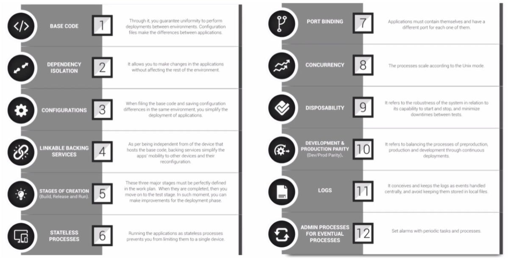

###### Cloud Native Application

### Cloud Native 기능

##### CI/CD

- 지속적인 통합, CI (Continuous Integration)
  - 통합 서버, 소스 관리 (SCM), 빌드 도구, 테스트 도구
  - ex) Jenkins, Team CI, Travis CI
- 지속적 배포
  - Continuous Delivery
  - Continuous Deployment
  - pipe line
- 카나리 배포와 블루그린 배포
  - 카나리 배포: 95%는 이전 버전 서비스, 5%는 새 버전
  - 블루그린: 점진적으로 이전

##### DevOps

- 고객의 요구사항, 오류사항, 개선사항 등은 그때그때 반영되는 것이 좋음
- 어플리케이션은 고객의 요구사항에 맞는 에러없는 완성물이어야 함
- 자주 테스트, 피드백, 업데이트를 받는 과정을 거쳐 전체 개발 일정이 완료될 때까지 지속적으로 끊임없이 진행해 나가는것을 **DevOps**
- Cloud Native Application은 이러한 DevOps 환경에 맞춰서 서비스의 구조를 작은 단위로 분할할 수 있게 함으로써, 자주 통합/테스트/배포 할 수 있는 구조를 제공

##### Container 가상화

- 기존에 로컬환경에서 운영하고 유지해야만 했던 시스템을 클라우드 환경으로 이전해서, 적은 비용으로 탄력성있는 시스템을 구축할 수 있게 함.
- 하드웨어 가상화, 서버 가상화 보다 더 작은 리소스를 사용하여 가상화 서비스를 구축할 수 있음

---

###### 12 Factors

### 12 Factors

1. **코드 베이스:** 자체 레포지토리에 저장된 각 마이크로 서비스에 대한 단일 코드 베이스 

   (for 버전 제어, 형상 관리)

2. **종속성:** 각 마이크로서비스는 자체 종속성을 가지고 패키지 되어 있어서, 전체 시스템에 영향을 주지 않는 상태에서 변경되고 내용을 수정할 수 있음
3. **구성 정보:** 시스템 코드 외부에서 구성관리 도구를 통해서 마이크로서비스에 필요한 작업들을 제어
4. **서비스 지원:** 보조 서비스 (DB,캐시,메시지 브로커) 들을 이용해서 마이크로서비스가 가져야할 기능들을 추가할 수 있게 함
5. **빌드,릴리즈, 실행 환경 분리:** 코드를 배포하기 위해 실행 단계까지 옮기는 과정을 엄격하게 분리해야 함. 각각은 고유 태그를 가지고 있어야 하고, 롤백 기능, CI/CD 시스템을 완벽하게 이용해서 자동화
6. **프로세스:** 각각의 마이크로 서비스는 분리된 채 자체 서비스에서 실행될 수 있어야 함. 필요한 자원은 캐시, 데이터 저장소 형태를 이용해서 외부의 데이터와 동기화해야 함.
7. **포트 바인딩:** 각각의 마이크로 서비스는 자체 포트에서 노출되는 인터페이스와 기능과 함께 자체 포함되는 기능들이 있어야 함.
8. **동시성:** 수많은 동일한 프로세스로 복사해서 확장해 나가게 함으로써, 부하분산을 가능케 하기 때문에, 이 수많은 인스턴스들이 동시성을 가져야 함.
9. **삭제가능성:** 서비스 인스턴스 자체가 삭제 가능해야함. 
10. **개발 단계와 프로덕션 단계 구분:** 다른 쪽의 작업과 중복/종속성이 없는 환경에서 서비스를 유지해야 함
11. **로깅 시스템:** 마이크로 서비스에 의해서 생성된 로그를 이벤트 시스템으로 출력해야 함.
12. **프로세스:** 리포팅, 데이터 정리/분석 등을 포함하는 관리 프로세스가 필요함.

---

###### Monolithic vs. Microservice

#### 모놀리식

- **모든 업무 로직이 하나의 애플리케이션 형태로 패키지 되어 서비스**
- 애플리케이션에서 사용하는 데이터가 한 곳에 모여 참조되어 서비스되는 형태

- 하나의 어플리케이션에서 유기적으로 연결되어 작동
- 배포되기 위해, 서로 의존성을 가진 채 패키징

#### 마이크로서비스

- **어플리케이션을 구성하는 각각의 구성 요소 및 서비스의 내용을 분리해서 개발, 운영**
- 유지 보수, 변경사항을 적용하는데 좋음
- 다른 서비스에 주는 영향을 최소화, 독립적 배포 가능
- 어플리케이션 전체가 다운타임이 되는 상태를 없앨 수 있음
- 최소한의 중앙 집중식 관리가 되어야 함 

---

###### SOA vs. MSA

#### 서비스의 공유 지향점

SOA - 재사용을 통한 비용 절감 (서비스 공유 최대화)

MSA - 서비스 간의 결합도를 낮추어 변화에 능동적으로 대응 (서비스 공유 최소화)

#### 기술 방식

SOA - 공통의 서비스를 ESB(서비스 버스) 에 모아 사업 측면에서 공통 서비스 형식으로 서비스 제공

MSA - 각 독립된 서비스가 노출된 REST API를 사용

---

#### RESTful 

##### LEVEL 0 

- 리소스를 웹서비스 상태로 url 매핑

##### LEVEL 1

- 적절한 패턴으로 url

##### LEVEL 2

- HTTP Methods 추가

##### LEVEL 3

- **Hateoas** 추가
- 다음 url을 알 수 있음

### Restful 특징

- Consumer first (API를 사용하고 있는 소비자/개발자를 우선으로 생각)
- HTTP의 장점을 최대한 살리기
- HTTP Methods 연동
- 적절한 상태코드 보내기
- 복수 형태의 uri를 사용
- 명사 형태로 표현
- 일관적인 End Point

---

###### Microservice Architecture Structures

### MSA 흐름

- 클라이언트/다른 MS 가 `API Gateway`라는 진입점을 통해 필요한 서비스를 요청

- `Service Router`에게 어디로 가야할지 물어봄

- 필요한 MS가 어디에 저장되어 있는지 `Service Discovery`에 물어봄

- MS가 다중 인스턴스로 구성되어 있다면, `Load Balancing`을 통해서 어디로 갈지 결정
- 환경설정 정보는 configuration service를 통해서 외부 시스템에 저장해서 사용
- `Telemetry`는 모니터링과 진단 

---

###### Spring Cloud

#### Spring Cloud

- 환경설정: Spring Cloud Config Server
- 서비스 정보 등록: Naming Server (Eureka)
- 로드 밸런싱: Ribbon (Client Side), Spring Cloud Gateway
- 더 쉬운 REST 통신: FeignClient
- 시각화와 모니터링: Zipkin Distributed Tracing, Netflix API gateway
- 장애 복구: Hytrix