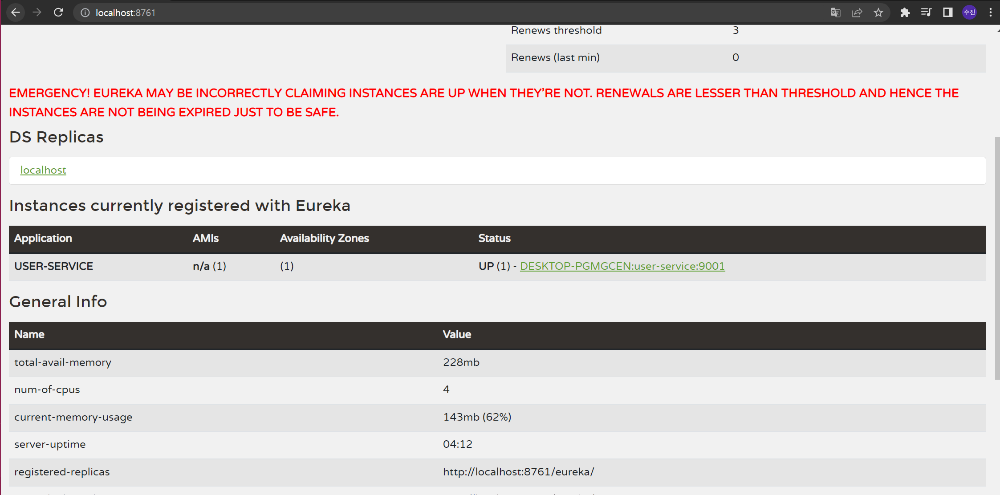

###### User Service - 프로젝트 생성

##  User Service

- 유레카클라이언트 생성

  - `@EnableDiscoveryClient` 어노테이션을 붙이기

- properties 작성

  ```properties
  # 포트 설정 (유레카가 웹서비스 형태로 제공되며, 이것의 포트)
  server.port=8761
  # 각각의 마이크로 서비스의 고유 ID
  spring.application.name=discoveryservice
  # 아래 값들의 기본값이 true
  # 유레카 라이브러리를 포함한 채 스프링 부트를 실행하면, 클라이언트의 역할로 등록하려고 함
  # Eureka Server는 기동하되, 다른 MS가 검색하지 않도록 설정
  eureka.client.register-with-eureka=false
  # Eureka Server로부터 인스턴스들의 정보를 주기적으로 가져올 것인지를 설정하는 속성
  eureka.client.fetch-registry=false
  eureka.client.service-url.defaultZone=http://127.0.0.1:8761/eureka
  ```

  


### 실행



- 빨간 색 경고 문구는 곧 사라질 거니까 무시해도 됨
- 인스턴스의  `Status`에서 UP은 실행되고 있는 상태, DOWN은 꺼진 상태
  - `IP-address` + `Application 이름` + `Port 번호`

---

###### User Service - 등록

##### ⭐ IntelliJ를 이용하여 다른 port로 서비스를 실행하는 법⭐

- `Edit Configurations`
- 기존 아이템을 복사
-  VM Options : `-Dserver.port=9002`
  - `-D`: 자바 클래스를 실행할 때 부가적인 파라미터 옵션을 부여

#### IntelliJ가 아닌 커맨드창을 이용한 실행 방법

- 빌드 도구인 Maven 설치

1. Maven 빌드 도구 사용

   - `mvn spring-boot:run -Dspring-boot.run.jvmArguments='-Dserver.port=9003'`

   - 일반 커맨트창에서는 안됐지만 Git Bash에서는 됨
   - IntelliJ에서는 안됐으나, cmd 창에서 직접 실행하니 됨

2. 자바의 jar 파일을 이용해서 jar를 직접 실행

   - `mvn clean`

   - `mvn compile package`

   - `java -jar -Dserver.port=9004 .\target\user-service-0.0.1-SNAPSHOT.jar`

   - IntelliJ에서는 안됐으나, cmd 창에서 직접 실행하니 됨

---

###### User Service - Load Balancer

## 매번 직접 설정해줘야하는 포트, 쉽게 할 수 있는 방법은?

- 랜덤 포트를 할당하자

  - port를 0으로 설정해서 랜덤 포트를 가지도록 함

- **하지만,** 랜덤포트를 갖지만, Eureka servier에서는 인스턴스 이름이 포트 0으로 한개만 등록됨.

- 동적으로 할당된 port를 가지도록 설정하기

  ```properties
  eureka:
    instance:
      instance-id: ${spring.cloud.client.hostname}:${spring.application.instance_id:${random.value}}
  ```

  

  

