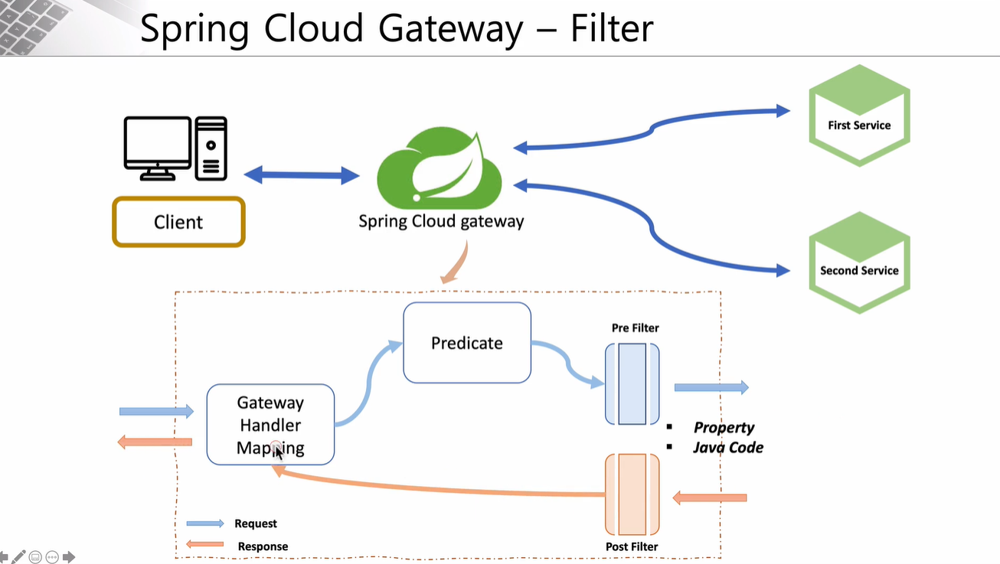
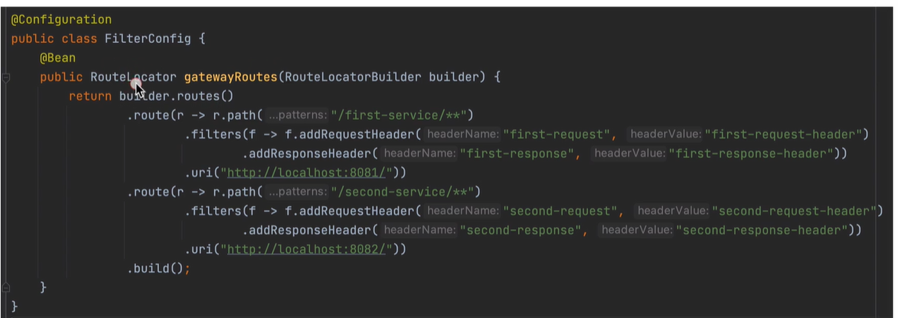

###### Netflix Zuul - Filter 적용

### Zuul 서비스에 필터 적용

- `ZuulFilter`를 상속받는 필터 작성 & 상속 메서드 작성

  - ##### FilterType : 종류가 뭔지 (pre / post)

  - ##### FilterOrder: 순서

  - ##### shouldFilter: 옵션에 따라서 필터로 쓰거나 쓰지 않도록 설정

  - ##### run: 실행할 동작 설정

- 로깅을 위한 코드 작성

  - slf4j 의 logger 사용

    `Logger logger = LoggerFactory.getLogger(ZuulLoggingFilter.class);`

    (lombok을 사용하면 `@Slf4j` 어노테이션으로 축약가능)

  - 로그레벨 (info, warn, debug, ...) 

  - ##### RequestContext

    - resquest, response에 대한 정보를 가지고 있음

      ```java
      @Override
      public Object run() throws ZuulException {
          log.info("*********** printing logs: ");
      
          RequestContext ctx = RequestContext.getCurrentContext();
          HttpServletRequest request = ctx.getRequest();
          log.info("*********** printing logs: " + request.getRequestURI());
          return null;
      }
      ```

      

---

###### Spring Cloud Gateway 란?

### Spring Cloud Gateway 

- **기존의 Zuul은 동기방식, Spring Cloud는 비동기방식**
- 기존에는 Tomcat 서버였지만, Spring Cloud는 Netty 서버로 비동기 처리

##### application 설정

```properties
server:
  port: 8000
eureka:
  client:
    fetch-registry: false
    register-with-eureka: false
    service-url:
      defaultZone: http://localhost:8761/eureka

spring:
  application:
    name: apigateway-service
  cloud:
    gateway:
      routes:
        - id: first-service
          uri: http://localhost:8081/
          predicates:
            - Path=/first-service/**
        - id: second-service
          uri: http://localhost:8082/
          predicates:
            - Path=/second-service/**
            
            # Path도 같이 전달되기 때문에 주의할 것
```

---

###### Spring Cloud Gateway - Filter 적용

### Spring Cloud Gateway 동작 



- **Gateway Handler Mapping** : 어떤 요청이 들어왔는지 받음
- **Predicate** : 어떤 것인지 판단
- **Filter** : 작업 전 후에 호출 (property / java code로 설정 가능)


#### 필터 설정

##### 1) Java Code

- `@Configuration` 어노테이션을 클래스에 추가하면, 스프링 부트가 작동될 때 모여서 메모리에 등록됨

  - 등록되는 빈의 이름은 `@Bean` 어노테이션이 붙여진 메서드의 반환 클래스 명 (ex. `RouteLocator`)

    

- Lambda (익명 클래스) : 클래스나 인터페이스를 선언하지 않은 상태에서 직접 인스턴스를 생성/소멸 할 수 있음

---

###### Users Microservice - welcome() 메소드

### 마이크로서비스

##### Jar vs War 차이점

- `java -jar {jar 파일 이름}` 하면 스프링 부트에 포함되어 있는 톰캣과 같은 내장 서버를 작동하면서 스프링이 기동
- war를 사용하면 어플리케이션 형태가 web.xml 과 같이 웹 형태로 바뀜. 내장 톰캣을 가지고 있지 않기 때문에 외부의 WAS (ex. 톰캣) 에다가 서비스를 배포해야 함.

##### 유레카 서버 실행 (IDE 사용 X)

- git bash에서 DiscoveryServer 가 있는 위치로 가서 `mvn spring-boot:run` 명령어로 유레카서버 실행시키기

##### H2 적용

- h2 의존성 추가
  - scope을 `test`로 하면, 실행할 때 결과를 확인할 수 없음 -> `runtime`

```xml
<!-- https://mvnrepository.com/artifact/com.h2database/h2 -->
<dependency>
    <groupId>com.h2database</groupId>
    <artifactId>h2</artifactId>
    <version>2.1.214</version>
    <scope>runtime</scope>
</dependency>
```

- `pom.xml` 설정 추가

  ```yaml
  spring:
    h2:
      console:
        enabled: true
        settings:
          web-allow-others: true
        path: /h2-console
  ```

  