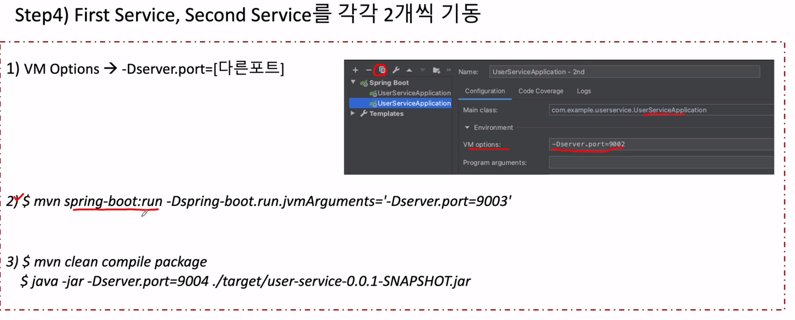

###### Spring Cloud Gateway - Load Balancing 1

##### 1. Eureka Cloud 의존성 추가

```xml
<dependency>
    <groupId>org.springframework.cloud</groupId>
    <artifactId>spring-cloud-starter-netflix-eureka-client</artifactId>
</dependency>
```

##### 2. application.yml 에서 유레카 클라이언트 등록

```yaml
eureka:
  client:
    fetch-registry: true
    register-with-eureka: true
    service-url:
      defaultZone: http://localhost:8761/eureka
```

##### 3. API Gateway 라우팅 설정 변경

- `http://**` 가 아닌 `lb://**` 로 변경

```yaml
routes:
- id: first-service
  uri: lb://MY-FIRST-SERVICE
  predicates:
    - Path=/first-service/**
  filters:
    - CustomFilter
```

- 여기서 드는 의문!
  - 등록한 이름은 소문자 `my-first-service`인데, 여기 설정에서는 대문자로 등록함.
  - 소문자로 해도 될까?
  - **된다~~**

##### 4. 실행 (유레카 서버, Gateway, 서비스들)


---

###### Spring Cloud Gateway - Load Balancing 1

### 서비스를 2개 기동하는 3가지 방법



##### port = 0 으로 설정하여 랜덤 포트를 부여하는 방법

```yaml
# port를 0으로 설정하여 랜덤 포트 부여
server:
  port: 0

# 유레카 서버에 동일한 인스턴스 이름으로 등록되어 구분이 안됨 -> 구분되도록 설정
eureka:
  instance:
    instance-id: ${spring.application.name}:${spring.application.instance_id:${random.value}
```


##### 2개를 기동한 후 컨트롤러에서 포트 출력

- `Environment` 사용

  ```java
  Environment env;
  
  @Autowired
  public FirstServiceController(Environment env){
      this.env = env;
  }
  ```

- `HttpServletRequest `사용

  ```java
  @GetMapping("/check")
      public String check(HttpServletRequest request) {
          log.info("Server port={}, ",request.getServerPort());
          return String.format("Hi, there. This is a message From first Service on Port %s.", env.getProperty("local.server.port"));
      }
  ```

  

- 정해진 포트가 아닌 랜덤 포트를 사용함
- 정해진 포트로 라우팅하지 않고, 이름으로 매칭시켜서 라우팅 함.
- 인스턴스를 자유롭게 늘리거나 뺄 수 있음.