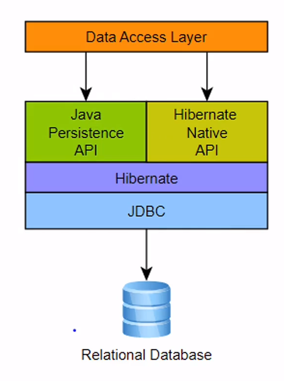

###### Users Microservice - 프로젝트 생성

#### 1. H2 설정

- 이전의 스프링은 자동으로 데이터베이스를 생성해주었으나, 현재의 버전은 직접 생성해야 함.
- `1.3.176` 버전으로 다운그레이드

---

###### Users Microservice - 사용자 추가

- 비밀번호는 암호화한 후 DB에 저장할 것

##### JPA

- 관계형 DB의 데이터를 사용하기 위해서 `JDBC`를 사용했음.
- 쿼리 입력없이 사용할 수 있도록 하는 것이 `JPA`
- 이 바탕은 `Hibernate`



##### modelmapper

- DTO를 Entity로 손쉽게 변환 가능

```java
ModelMapper mapper = new ModelMapper();
mapper.getConfiguration().setMatchingStrategy(MatchingStrategies.STRICT);
UserDto userDto = mapper.map(user, UserDto.class);
```

