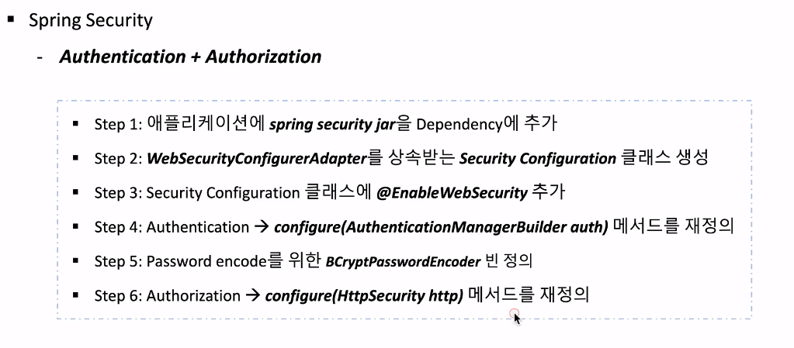
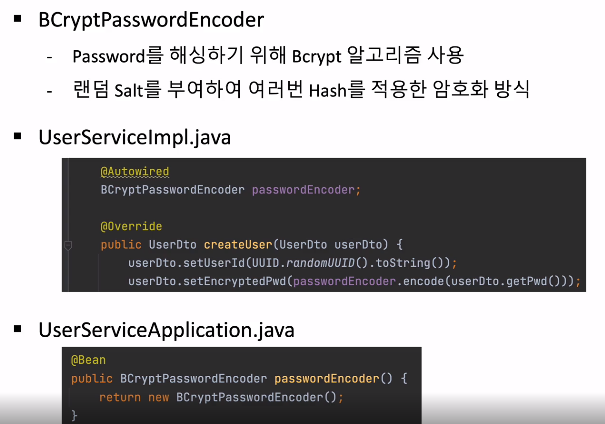

###### Users Microservice - Spring Security 연동



#### WebSecurity

```java
// 다른 빈들보다 우선순위를 앞으로해서 등록
@Configuration
// webSecurity를 위해 사용될 것
@EnableWebSecurity
public class WebSecurity extends WebSecurityConfigurerAdapter {

}
```



- 가장 먼저 호출되는 스프링 어플리케이션 기동 클래스에 `BCryptPasswordEncoder` 빈을 등록함.

---

###### Users Microservice와 Spring Cloud Gateway 연동

##### 포트번호 출력

```java
return String.format("It's Working in User Service on PORT %s",
env.getProperty("local.server.port"));
```

- `/user-service/**` 로 요청이 들어오면 해당 서비스로 라우팅되도록 설정했음
- 하지만 해당 서비스의 base url 에 prefix를 수정하지 않았기 때문에 404 에러가 발생했었음.

---

###### Catalogs Microservice - 기능 구현 1

##### 로그 레벨 설정

```yaml
logging:
  level:
    com.example.catalogservice: DEBUG
```

##### 현재시간 저장

```java
@Column(nullable = false, updatable = false, insertable = false)
@ColumnDefault(value = "CURRENT_TIMESTAMP")
private Date createdAt;
```

