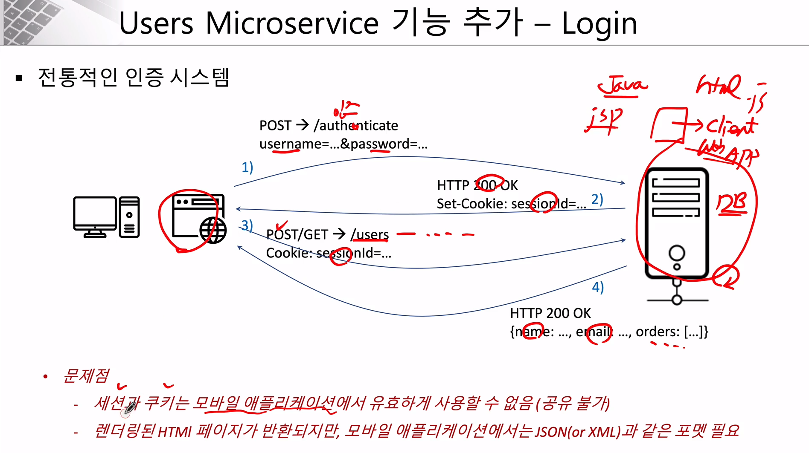
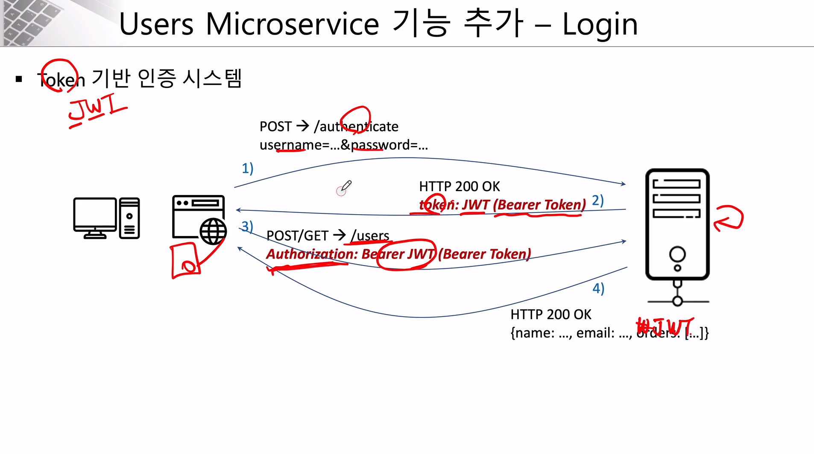
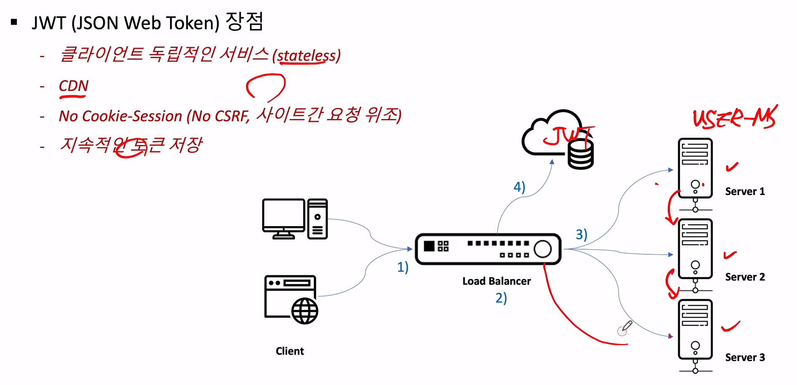
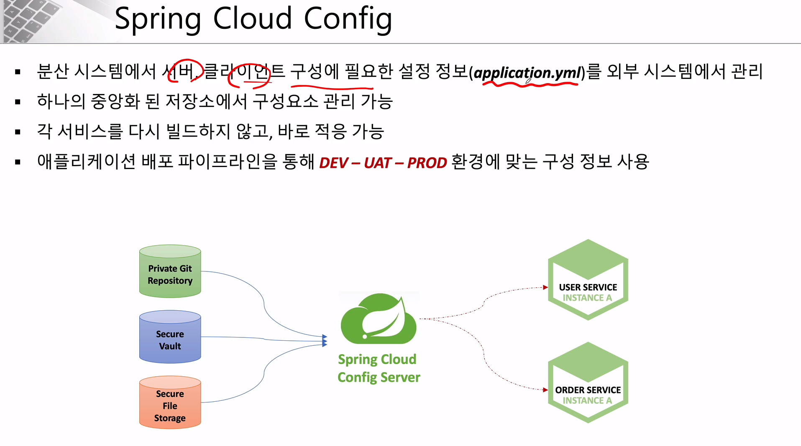

###### Users Microservice - JWT 처리 과정

#### 전통적인 인증 시스템

- C->S : 계정 정보 전달
- S -> C: 상태 정보
- C -> S: 인증이 필요한 서비스 요청
- S -> C: 요청에 대한 응답



- React와 Java 가 통신을 하면, 세션 공유가 되지 않음. (JSP & Java / Reduct 사용하면 가능)

#### Token 기반 인증 시스템

- C->S : 계정 정보 전달
- S -> C: 토큰 발급
- C -> S: 토큰과 함께 인증이 필요한 서비스 요청
- S -> C: 요청에 대한 응답





- 1번 서버와 3번 서버의 세션 공유를 따로 하지 않아도 1번 서버에서 발근된 JWT를 db에 저장만 해도 서버 3에서 사용함으로써 세션 공유가 가능

---

###### Users Microservice - AuthorizationHeaderFilter 추가

##### Mono, Flux

- Spring WebFlux에서 나오는 객체이고, 반환값을 담는 객체
- Mono는 단일 값을 담고, Flux는 여러가지를 담은 것


---

###### Spring Cloud Config



---

###### Spring Cloud Config - 프로젝트 생성

##### Spring Cloud Config 서버 생성

1. `ecommerce.yml` 파일 생성

2. 깃 추적 시작 (커밋까지만 하고 푸쉬는 X, 로컬에서만 쓰기 때문)

3. 프로젝트 생성, Spring Cloud Config 의존성만 추가

4. Application에 `@EnableConfigServer` 추가

5. `application.yml` 작성

   ```yaml
   server:
     port: 8888
   
   spring:
     application:
       name: config-service
     cloud:
       config:
         server:
           git:
             uri: file://C:\Users\LGuser\Desktop\git-local-repo
   ```

6. config 서버 접속 (`http://localhost:8888/ecommerce/default`)

---

###### Users Microservice에서 Spring Cloud Config 연동 2

##### User-service 에서 Spring Cloud Config에 등록한 설정값 가져오기

1. `cloud-starter-config` 와 `cloud-starter-bootrap` 의존성 추가

2. `bootstrap.yml` 생성

   ```yaml
   spring:
     cloud:
       config:
       # Config 서버
         uri: http://127.0.0.1:8888
         # 등록한 yml 파일 이름
         name: ecommerce
   ```

   

##### Spring Boot Actuator

- Application 상태, 모니터링
- Metric 수집을 위한 Http End point 제공

- **실습** (refresh, health, beans)

  1. `Spring boot starter actuator` 의존성 추가

  2. `WebSecurity` 에서 actuator 요청에 대한 접근제한 해제

     ```java
     http.authorizeRequests()
                     .antMatchers("/actuator/**").permitAll()
     ```

  3. `application.yml` 설정 추가

     ```yaml
     management:
       endpoints:
         web:
           exposure:
     #        refresh: 마이크로서비스에서 config로부터 가져와야 하는 정보들을 refresh
             include: refresh, health, beans
     ```

  4. `http://desktop-pgmgcen:64361/actuator/{health}` 접속 
  5. refresh 의 경우는 postman에서 요청  `Method=Post`

- **실습 2** (httptrace)

  1. 실습 1과 같이 환경설정

  2. include에 `httptrace` 넣기

  3. Application 에서 HttpTraceRepository 빈 등록

     ```java
     @Bean
     public HttpTraceRepository httpTraceRepository() {
         return new InMemoryHttpTraceRepository();
     }
     ```

     