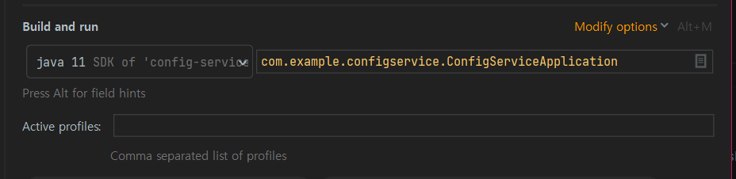

###### Profiles을 사용한 Configuration 적용

1. `ecommerce-{dev,prod}.yml` 로 파일을 생성

2. 적용하고 싶은 프로젝트의 bootstrap.yml에 다음 설정을 추가

   ```yaml
   spring:
     profiles:
       active: prod
   ```

3. 실행 configuration의 profile active 파라미터 값으로 설정해도 됨

   

---

###### Native File Repository

##### 깃시스템이 아닌 로컬 파일 시스템에 설정 저장

**🤷‍♂️이 부분은 이해 안되는 부분이 있음🤷‍♂️**

---

###### Spring Cloud Bus 개요

#### Configuration 설정이 변경된 후 적용방법

1. ~~서버 재기동~~ -> 의미 없는 방법

2. Actuator refresh -> Application 마다 refresh 해야하는데, 너무 번거러움

3. Spring cloud bus 사용
   - 분산 시스템의 노드를 경량 메시지 브로커 (RabbitMQ) 와 연결
   
   - 상태 및 구성에 대한 변경 사항을 연결된 노드에게 전달 (Broadcast)
   
     

##### AMQP (Advanced Message Queuing Protocol), 메시지 지향 미들웨어를 위한 개방형 표준 응용 계층 프로토콜

- 메시지, 지향, 큐잉, 라우딩 (P2P, Publisher-Subscriber), 신뢰성, 보안
- Erlang, RabbitMQ에서 사용

##### Kafka 프로젝트

- Apache Software Foundation 이 Scalar 언어로 개발한 오픈 소스 메시지 브로커 프로젝트
- 분산형 스트리밍 플랫폼
- 대용량의 데이터를 처리 가능한 메시징 시스템

#### RabbitMQ vs Kafka

- ##### RabbitMQ

  - 메시지 브로커
  - 초당 20+ 메시지를 소비자에게 전달
  - 메시지 전달 보장, 시스템 간 메시지 전달
  - 브로커, 소비자 중심

- ##### Kafka

  - 초당 100k+ 이상의 이벤트 처리
  - Pub/Sub, Topic 에 메시지 전달
  - Ack 를 기다리지 않고 전달 가능
  - 생산자 중심
  - RabbitMQ와 달리 시스템에 바로 보내지 않고, Topic에 보내면 subscriber이 가져감

##### Actuator bus-refresh Endpoint

- 분산 시스템의 노드 (마이크로 서비스) 를 경량 메시지 브로커와 연결
- 상태 및 구성에 대한 변경 사항을 연결된 노드에게 전달 (Broadcast)
- 어떤 마이크로서비스에 요청을 해도 Spring Cloud Bus에 연결되어 있는 모든 마이크로 서비스에 다 적용

---

###### RabbitMQ 설치

- Erlang 설치: RabbitMQ의 언어

- RabbitMQ 설치

- 플러그인 활성화

  - **management 플러그인 활성화**

     웹 상에서의 관리/확인을 위해 rabbitmq management 를 활성화 합니다.

    ```
    rabbitmq-plugins enable rabbitmq_management
    ```

    **mqtt 플러그인 활성화**

    RabbitMQ 에서 기본으로 사용하는 프로토콜은 amqp 입니다. 다른 프로토콜을 사용하려면 해당 프로토콜의 플러그인을 활성화 해야 합니다.

    mqtt 를 사용하기 위해 mqtt 플러그인을 활성화 합니다.

    ```
    rabbitmq-plugins enable rabbitmq_web_mqtt
    ```

- http://localhost:15672/#/ 접속 `(guest/guest)`

##### RabbitMQ 포트

- 웹브라우저 포트 : 15672
- 시스템 상에서의 포트: 5672

---

