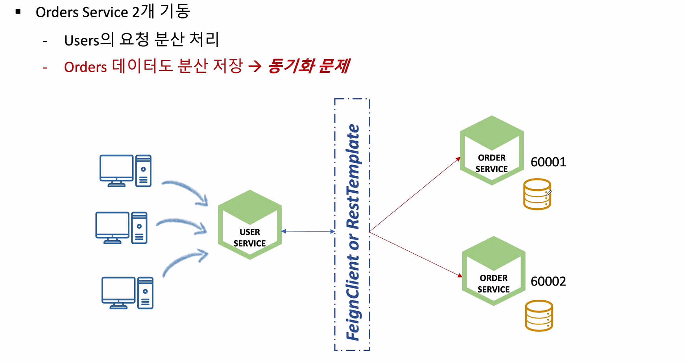
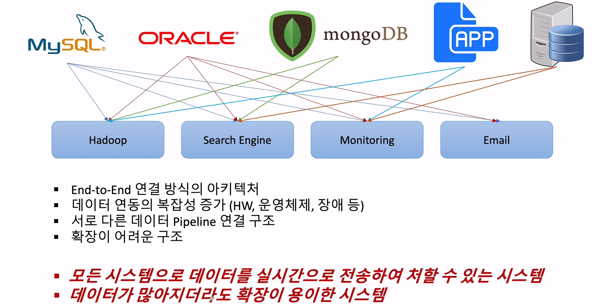
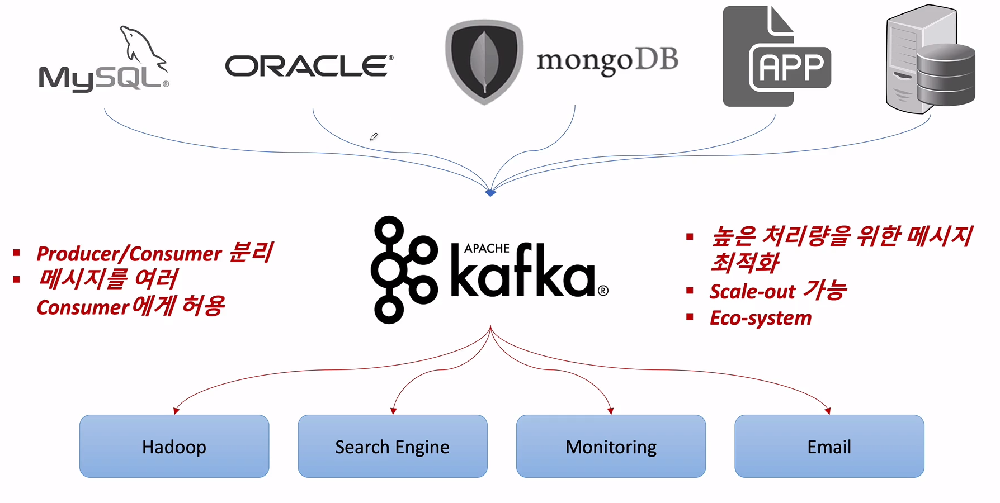
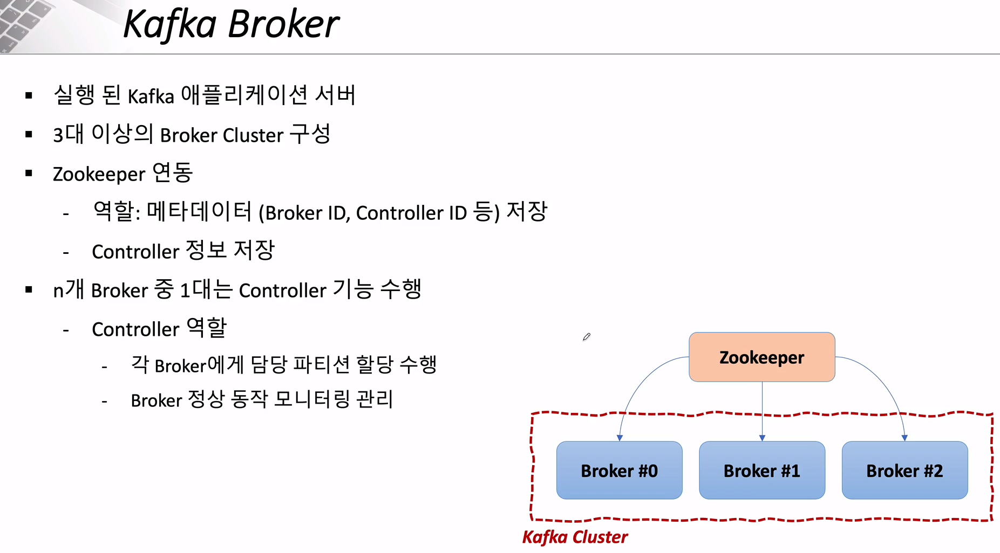
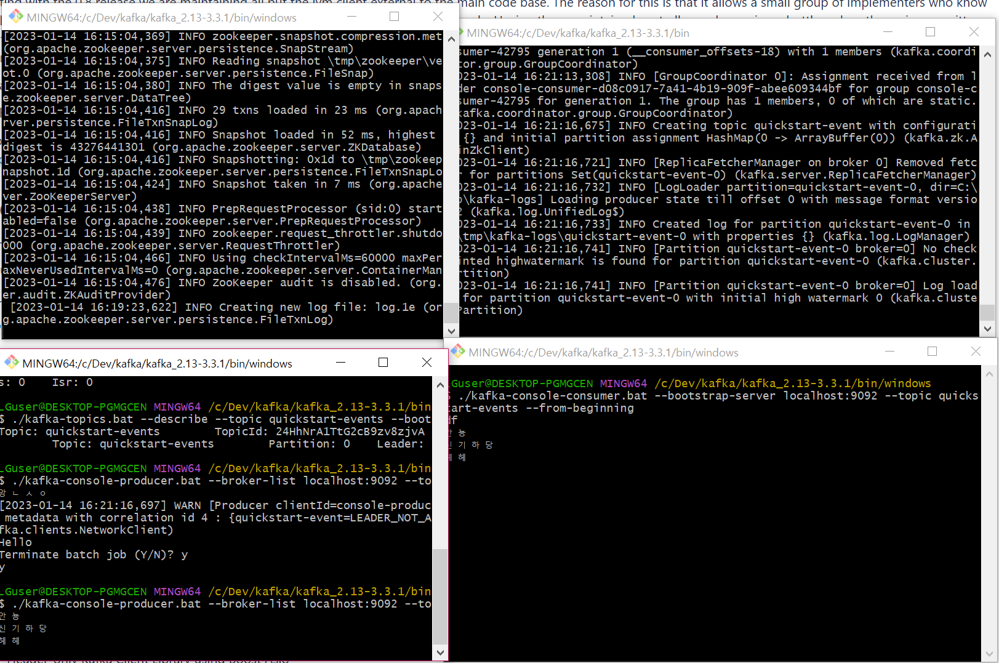
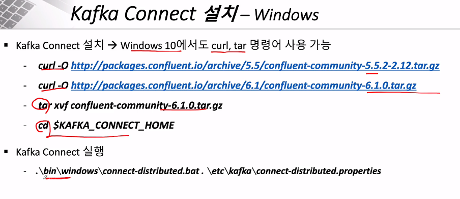
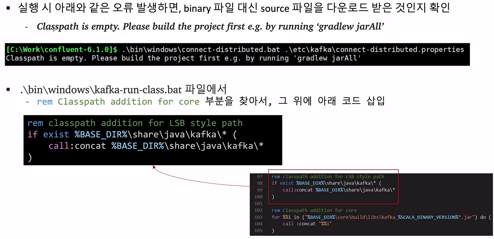
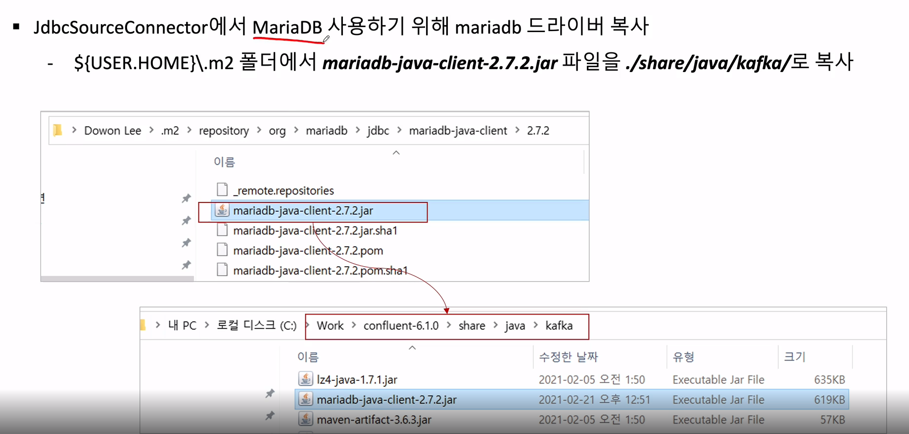
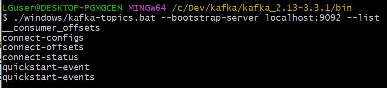

###### 데이터 동기화 문제

## 데이터 동기화 문제

- 로드밸런싱을 위한 복수개의 인스턴스 서버를 구동하면 각 인스턴스 서버에서 db가 실행되기 때문에, 데이터 동기화 문제가 발생할 수 있음
- user에서 order 정보를 불러오면, 요청할 때마다 다른 DB에 저장되어 있는 order 리스트를 가져옴



##### 문제 해결 방법

- 하나의 데이터베이스 사용 (동시성, 트랜잭션 관리 해줘야 함)
- Message Queuing Server을 이용한 DB 간의 동기화
- Kafka Connector + DB


---

###### Apache Kafka의 활용

## Apache Kafka

- 메시지를 전달해주는 서버








- 장애를 복구하기 위해서 `코디네이터`라는게 사용되는데, 아파치에서는 `Zookeeper`가 코디네이터 역할

---

###### Apache Kafka 설치

`C:\Dev\kafka` 에 다운받은 tgz 파일 넣고

`tar xvf kafka_~~` 명령으로 압축풀기

---

###### Apache Kafka 사용 - Producer/Consumer

## Apach Kafka 테스트를 위한 명령어

#### 명령어

- Zookeeper 및 Kafka 서버 구동
  - `KAFKA_HOME/bin/zookeeper-server-start.sh KAFKA_HOME/config/zookeeper.properties`
  - `KAFKA_HOME/bin/kafka-server-start.sh KAFKA_HOME/config/server.properties`
- Topic 생성
  - `KAFKA_HOME/bin/kafka-topics.sh --create --topic quickstart-events --bootstrap-server localhost:9092 --partitions 1`
- Topic 목록 확인
  - `KAFKA_HOME/bin/kafka-topics.sh --bootstrap-server localhost:9092 --list`
- Topic 정보 확인
  - `KAFKA_HOME/bin/kafka-topics.sh --describe --topic quickstart-events --bootstrap-server localhost:9092`

##### Windows

- Windows에서는 Kafka 실행 명령어는 `KAFKA_HOME/bin/windows` 폴더에 저장되어 있음


### Kafka Producer/Consumer 테스트

- 메시지 생산
  - `KAFKA_HOME/bin/kafka-console-producer.sh --broker-list localhost:9092 --topic quickstart-events`
- 메시지 소비
  - `KAFKA_HOME/bin/kafka-console-consumer.sh --bootstrap-server localhost:9092 --topic quickstart-events --from-beginning`

##### 테스트 방법

1. bash 창 4개를 띄움

2. 하나는 Zookeeper, 하나는 Kafka, 하나는 메시지 생산, 하나는 메시지 소비

   ##### 테스트창

   

---

###### Apache Kafka 사용 - Kafka Connect

#### Kafka Connect

- Kafka Connect를 통해 Data를 Import/Export 가능
- 코드 없이 Configuration 으로 데이터를 이동
- Standalone mode, Distribution mode 지원
  - RESTful API 통해 지원
  - Stream 또는 Batch 형태로 데이터 전송 가능
  - 커스텀 Connector를 통한 다양한 Plugin 제공 (File, S3, Hive, Mysql, etc ...)

ex) 파일에서 import해서 Mysql로 export


##### MariaDB 설치

- MariaDB 홈페이지에서 설치
- MySql의 포트가 3306으로 겹쳐서, 3307 포트로 설정

---

###### Orders Microservice에서 MariaDB 연동

- 하던 중에 MySQL 비번이 까먹은 걸 알게 돼서 

  https://blog.naver.com/oralol/222051630555 블로그 참조해서 비밀번호 초기화 시켜줌

#### MariaDB 설치 후 Spring과 연동

- mariaDB를 h2 console로 사용하기 위해서 강의에서 말한대로 다음과 같이 mariaDB dependency를 추가해줬음

  ```xml
  <dependency>
     <groupId>org.mariadb.jdbc</groupId>
     <artifactId>mariadb-java-client</artifactId>
  </dependency>
  ```

- 하지만,,,, 드라이버가 없다면서 `No suitable driver found for mariadb h2` 에러뜸

- 서칭하다가 mysql depency도 추가하고 나니까 됐다

  ```xml
  <dependency>
      <groupId>mysql</groupId>
      <artifactId>mysql-connector-java</artifactId>
  </dependency>
  ```

---

###### Kafka Connect 설치 1








---

###### Kafka Connect 설치 2

#### Kafka Connect 실행

- 다음의 명령으로 Kafka Connect 실행함

  ```bash
  $ ./bin/windows/connect-distributed.bat ./etc/kafka/connect-distributed.properties
  ```

- 에러가 발생하더니 중단됨
- zookeeper과 kafka 서버를 실행하고 다시 실행하니까 실행됨

##### Topic 리스트 출력

- 이전에 등록한 Topic 이외의 connect 관련 Topic들이 생성됨



#### Connector 등록

- **[Post]** `127.0.0.1:8083/connectors`

  ```json
  {
      "name" : "my-source-connect",
      "config" : {
          "connector.class" : "io.confluent.connect.jdbc.JdbcSourceConnector",
          "connection.url" : "jdbc:mysql://localhost:3307/mydb",
          "connection.user" : "root",
          "connection.password" : "root",
          "mode" : "incrementing",
          "incrementing.column.name" : "id",
          "table.whitelist" : "users",
          "topic.prefix" : "my_topic_",
          "tasks.max" : "1"
      }
  }
  ```

  

#### Connector 정보 확인

- **[Get]** `127.0.0.1:8083/connectors`
- **상세** - **[Get]** `127.0.0.1:8083/connectors/my-source-connect`


#### Connector 테스트

MariaDB에서 다음의 명령어로 value 추가

`insert into users(user_id, pwd, name) values('user1', 'test1111', 'User name');`


#### 에러 발생

- 위와 같이 db에 데이터를 삽입하면 자동으로 `my_topic_**` 이라는 토픽이 생성된다고 했는데 안 생김
- status를 확인하니 `No suitable driver found` 에러 발생

- https://wecandev.tistory.com/111 를 참조해서 `JDBC driver for MySQL` 을 다운 받음
- connect가 종료가 안돼서 bash 창을 강제로 종료하고 다시 실행하려고 하니, 이미 address가 사용 중이라고 함
- 8083 port를 강종 시켜서, 다시 실행해보니 제대로 됨