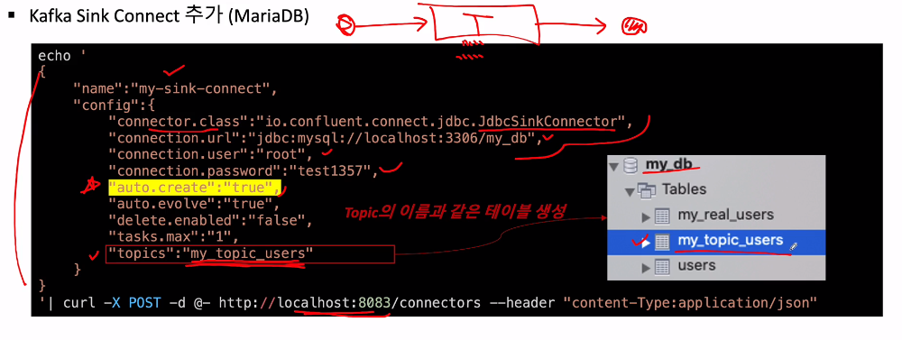
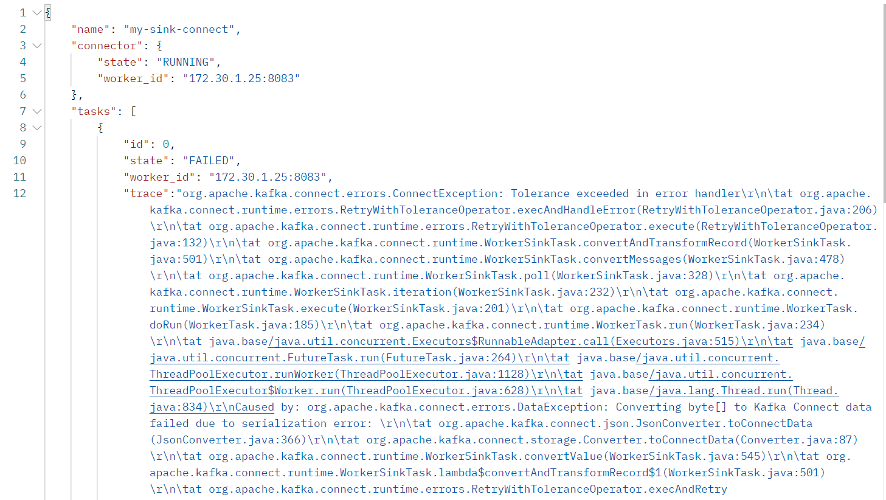
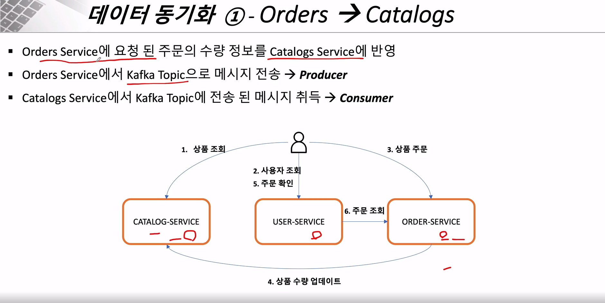

###### Kafka Sink Connect 사용

## Kafka Sink Connect

#### 

#### 필요 서버

1. Zookeeper Server
2. Kafka Server
3. Kafka console consumer
4. Kafka Connect


#### Sink Connector 생성

1. Sink Connector 생성 요청

   - [Post] `127.0.0.1:8083/connectors`

     ```json
     {
         "name":"my-sink-connect",
         "config":{
             "connector.class":"io.confluent.connect.jdbc.JdbcSinkConnector",
             "connection.url":"jdbc:mysql://localhost:3307/mydb",
             "connection.user":"root",
             "connection.password":"root",
             "auto.create":"true",
             "auto.evolve":"true",
             "delete.enabled":"false",
             "tasks.max":"1",
             "topics":"my_topic_users"
         }
     }
     ```

2. 생성된 테이블 확인

   - `show tables`

#### 에러

- db에 데이터를 넣고 sink로 빠져나가는건 잘됨

- producer로 직접 직렬화한 데이터를 넣으면 다음과 같은 에러가 발생

  

- connector을 삭제하고 다시 해봐도 저 에러가 남아있어서
- topic 이름을 변경한 후 다시 해봄
- bash창으로 하니까 첨에는 되다가 나중에 또 같은 에러가 발생
- command 창으로 하니까 잘 됨


---

###### Orders Microservice와 Catalogs Microservice에 Kafka Topic의 적용



###### 

#### Catalogs Microservice (Consumer)

##### KafkaConsumerConfig

```java
@Configuration
@EnableKafka
public class KafkaConsumerConfig {

    // 접속하고자 하는 정보 등록
    @Bean
    public ConsumerFactory<String, String> consumerFactory() {
        Map<String, Object> properties = new HashMap<>();
        properties.put(ConsumerConfig.BOOTSTRAP_SERVERS_CONFIG, "127.0.0.1:9092");
        properties.put(ConsumerConfig.GROUP_ID_CONFIG,"consumerGroupId");
        properties.put((ConsumerConfig.KEY_DESERIALIZER_CLASS_CONFIG), StringDeserializer.class);
        properties.put((ConsumerConfig.VALUE_DESERIALIZER_CLASS_CONFIG), StringDeserializer.class);

        return new DefaultKafkaConsumerFactory<>(properties);
    }

    @Bean
    public ConcurrentKafkaListenerContainerFactory<String, String> kafkaListenerContainerFactory() {
        ConcurrentKafkaListenerContainerFactory<String, String> kafkaListenerContainerFactory
                = new ConcurrentKafkaListenerContainerFactory<>();
        kafkaListenerContainerFactory.setConsumerFactory(consumerFactory());

        return kafkaListenerContainerFactory;
    }
}
```

##### KafkaConsumer

```java
@Service
@RequiredArgsConstructor
public class KafkaConsumer {
    private final CatalogRepository repository;

    @KafkaListener(topics = "example-catalog-topic")
    public void updateQty(String kafkaMessage) {
        log.info("Kafka Message: -> " + kafkaMessage);

        Map<Object, Object> map = new HashMap<>();
        ObjectMapper mapper = new ObjectMapper();
        try {
            map = mapper.readValue(kafkaMessage, new TypeReference<Map<Object, Object>>() {});
        } catch (JsonProcessingException ex) {
            ex.printStackTrace();
        }

        CatalogEntity entity = repository.findByProductId((String)map.get("productId"));
        if (entity != null) {
            entity.setStock(entity.getStock() - (Integer)map.get("qty"));
            repository.save(entity);
        }
    }
}
```


### Orders Microservice

##### KafkaProduerConfig

```java
@Configuration
@EnableKafka
public class KafkaProducerConfig {

    // 접속하고자 하는 정보 등록
    @Bean
    public ProducerFactory<String, String> producerFactory() {
        Map<String, Object> properties = new HashMap<>();
        properties.put(ProducerConfig.BOOTSTRAP_SERVERS_CONFIG, "127.0.0.1:9092");
        properties.put((ProducerConfig.KEY_SERIALIZER_CLASS_CONFIG), StringSerializer.class);
        properties.put((ProducerConfig.VALUE_SERIALIZER_CLASS_CONFIG), StringSerializer.class);

        return new DefaultKafkaProducerFactory<>(properties);
    }

    @Bean
    public KafkaTemplate<String, String> kafkaTemplate() {
        return new KafkaTemplate<>(producerFactory());
    }
}
```


##### KafkaProducer

```java
@Service
@RequiredArgsConstructor
public class KafkaProducer {
    private final KafkaTemplate<String, String> kafkaTemplate;

    public OrderDto send(String topic, OrderDto orderDto){
        ObjectMapper mapper = new ObjectMapper();
        String jsonInString = "";

        try {
            jsonInString = mapper.writeValueAsString(orderDto);
        } catch (JsonProcessingException e) {
            throw new RuntimeException(e);
        }

        kafkaTemplate.send(topic, jsonInString);
        log.info("Kafka Producer sent data from the Order micro service" + orderDto);

        return orderDto;
    }
}
```


##### 결과

- order 주문하면, catalog 의 재고가 줄어드는 것을 확인 **(동기화 성공)**