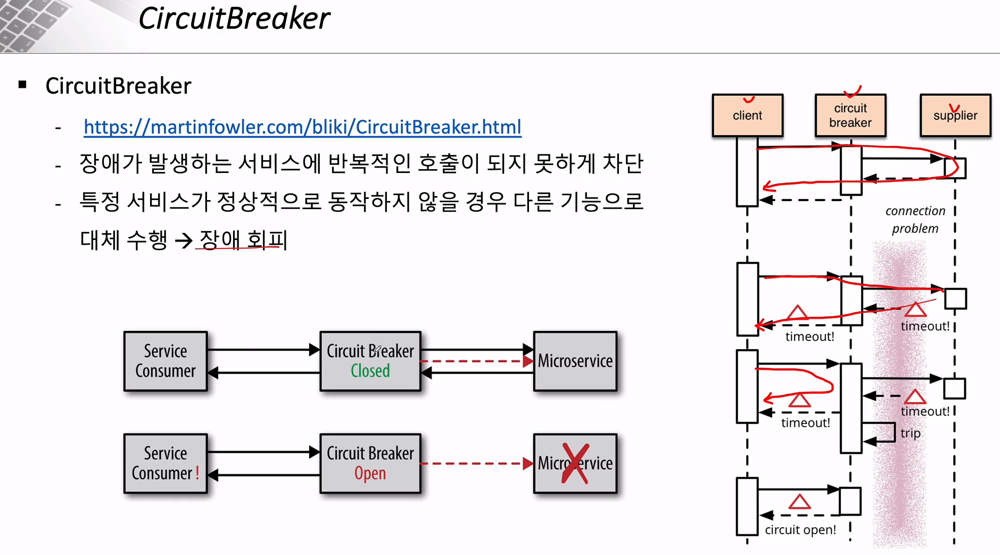

###### Orders Microservice 수정 - MariaDB

#### 멀티 서버를 위한 단일 DB 구축

##### orders 테이블 생성

```mysql
create table orders (
  id int auto_increment primary key,
  user_id varchar(50) not null,
  product_id varchar(20) not null,
  order_id varchar(50) not null,
  qty int default 0,
  unit_price int default 0,
  total_price int default 0,
  created_at datetime default now()
)
```

##### property - DB 설정 변경

```yaml
spring:
  datasource:
    url: jdbc:mariadb://localhost:3307/mydb
    driver-class-name: org.mariadb.jdbc.Driver
    username: root
    password: root
#    driver-class-name: org.h2.Driver
#    url: jdbc:h2:mem:testdb
```

---

###### Orders Microservice 수정 - Order Kafka Producer

- 이전에 개인 db에 저장하는 로직 (orderService.createOrder) 부분은 주석처리
- kafka로 데이터를 보내면, sink db인 단일 DB mariadb 로 넘어가게 작성할 것

#### Kafka 메시지에 보내기 위한 DTO 생성


---

###### 장애 처리와 Microservice 분산 추적 - CircuitBreaker와 Resilience4J의 사용



#### CircuitBreaker 구현

- 기존에 제공되었던 `Hystrix`는 업데이트가 중단되었기 때문에, `Resilience4j`로 대체해서 사용할 것


