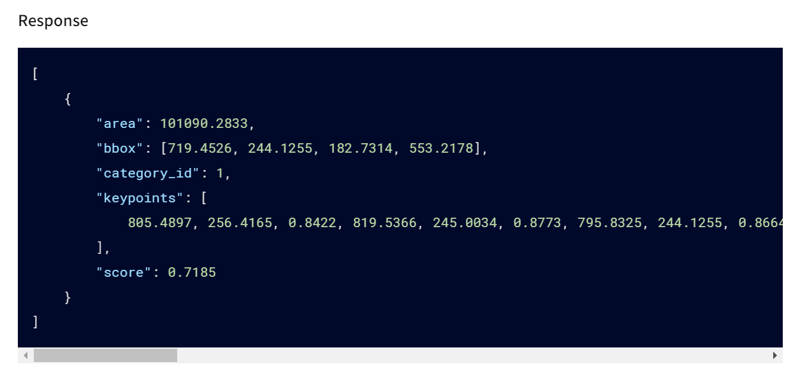

# 0220

## Post 와 Put 에서는 업데이트 된 객체를 반환하는 것이 좋을까?

##### 상황

- 기존 ssafy에서는 업데이트 된 것을 바로 반환해줘서 클라이언트에서는 따로 다른 요청을 할 필요 없이 데이터를 업데이트 시켜주도록 했음.
- 실제로는 어떻게 하는지 궁금해서 찾아봄

##### 서칭

- [RESTful 'PUT' 작업이 무언가를 반환해야 하는가](https://stackoverflow.com/questions/797834/should-a-restful-put-operation-return-something)

  - 업데이트 된 것을 넣으면 안된다는 것이 주였으나, 일부 업데이트 객체를 반환해도 된다는 의견도 있었음.

    

## 리스트 조회하는 API 에서 바로 리스트를 반환하는 것은 괜찮을까?

##### 상황

- findAll과 같은 리스트 조회 API 경우 리스트를 감싸지 않고 리스트를 바로 반환하는 게 괜찮은가 고민

##### 서칭

- 카카오는 리스트 바로 반환함

  

- 리스트를 객체로 반환하는 게 좋다는 글을 찾음 ([RESTful API에서 배열을 응답으로 반환하는 가장 좋은 방법은 무엇입니까](https://softwareengineering.stackexchange.com/questions/286293/whats-the-best-way-to-return-an-array-as-a-response-in-a-restful-api))
  - 배열만 반환하면 리소스 확장성이 떨어짐
    - 레코드 수를 추가하는 경우, 배열을 위한 접근 방식으로 개발되어 있기 때문에 많은 비용이 발생할 수 있음
  - JSON 배열로 반환되는 경우 데이터를 훔칠 수 있는 보안 취약점이 있다고도 함

## 멱등성

- **동일한 요청을 한 번 보내는 것과 여러 번 연속으로 보내는 것이 같은 효과를 지니고, 서버의 상태도 동일하게 남을 때**, 해당 HTTP 메서드가 멱등성
- 이중 `POST`를 제외한 나머지 HTTP 메서드를 사용하는 API(`GET`, `PUT`, `DELETE`)들이 멱등성이 유지

> 멱등성을 가지는 요청에 대해선 동시성 문제가 발생하지 않을지 세심하게 검토해봐야 할 것