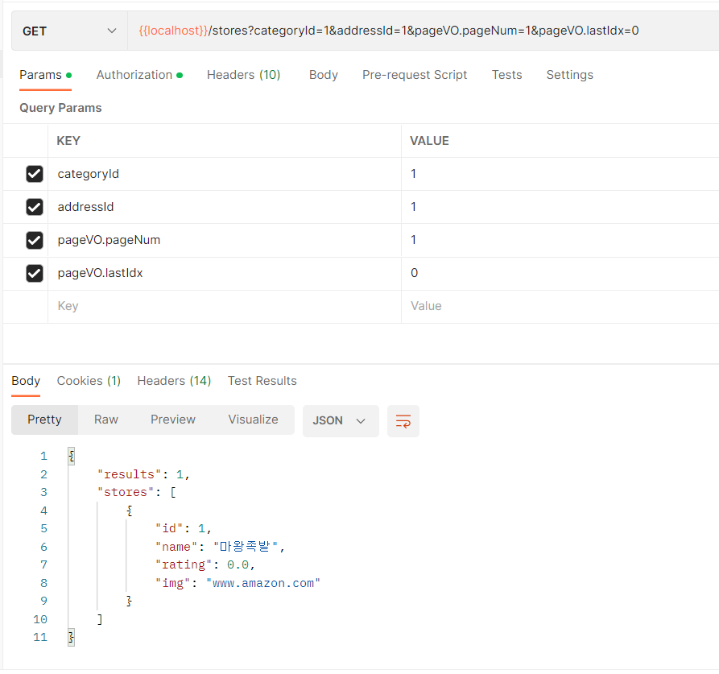

## 궁금했던 부분

## `@ModelAttribute` 을 사용했을 때 내부의 DTO도 매핑하는 방법

##### 상황

- 특정 카테고리의 주문할 수 있는 가게 리스트를 반환 해주는 컨트롤러를 작성함. 

- restAPI 에 따르면 `@GetMapping` 을 해야함.

- 그러면 파라미터를 body가 아닌 param으로 보내야 하기 때문에 매핑을 위해 `@ModelAttribute` 을 사용함

- 필요 파라미터로는 categoryId, addressId, pageVO(lastIdx, sort, pageNum) 등이 있음.

- pageVO는 재사용성이 있는 DTO이기 때문에 밖에 빼내는 건 좋지 않아 보임.

- 처음에 테스트를 할 때 categoryId, addressId, lastIdx, ... 으로 파라미터를 넣었는데 자동으로 DTO 내부를 매핑해주지 않았음.

- 다음과 같이 pageVO.lastIdx 와 같은 형태로 요청을 보내니 내부의 DTO가 매핑됨.

  

  

  


# 성능 최적화

## 1. 캐시

##### property 설정 

```yaml
spring:
  cache:
    redis:
      time-to-live: 86400000 #mills 단위 -> [1초 : 1000] ->   [1일 : 86400000]

  redis:
    port: 6379 #설정한 포트번호
    host: 127.0.0.1

```


##### `@EnableCaching` 시작점에 달아주기

```java
@EnableCaching
@SpringBootApplication
public class MonolithicApplication {

	public static void main(String[] args) {
		SpringApplication.run(MonolithicApplication.class, args);
	}

}

```


##### 사용 엔티티에 `implements Serializable` 추가


##### 캐싱 적용

- `@Cacheable(key = "#storeReq", cacheNames = "stores")` 어노테이션을 캐싱하고자 하는 메서드 위에 붙임

- 난 서비스 단에 붙임


##### 키를 primitiveType이 아닌 DTO로 사용하는 법

- `@ToString`  을 붙이기

  - `Serializable` 은 안 붙여도 됨.

- 객체 안의 객체에 `ToString`을 안 붙이면 다음과 같이 됨.

  

  


##### 어디에 적용할까?

- 수정의 거의 없는 가게 리스트에 캐시 적용하자


## 2. 읽기 전용

- `@Transactional(readOnly = true)` 는 필요한가?
  - Select 문에 대해서만 기능을 지원
  - Transaction ID 설정에 대한 오버헤드 해결 가능
    - Read Only 트랜잭션에 대해서는 ID가 부여되지 않음.
  - 스프링 프레임워크가 하이버네이트 세션 flush 모드를 MANUAL로 설정하기 때문에 강제로 flush를 호출하지 않은 한 flush가 일어나지 않아, CUD 작업이 동작하지 않고, 스냅샷 저장, 변경감지 등의 작업을 수행하지 않아 성능 향상
  - DB가 master와 slave로 나뉘어져 있으면 ReadOnly가 있는 경우 읽기 전용으로 slave를 호출함 -> DB 서버의 부하 줄이기 가능
  - [**@Transactional(readOnly = true)는 필요한가?**](https://cupeanimus.tistory.com/90)

- 하지만, 직접 해당 어노테이션을 붙이지 않아도 될 수도?
  - 기본적으로 save와 delete에 대해선 `@Transaction (readOnly = false)` 이 사용되고 있음
  - 마찬가지로 select 문인 find에 대해선 `@Transactional(readOnly = true)`  옵션이 사용되고 있음
  - 즉, jpa를 사용하면서 따로 설정을 하지 않아도 자동으로 사용되어 짐.
  - **[내추측]** 사용자 커스텀 쿼리가 아닌 기본적으로 주어지는 메서드 (findById, delete 등) 에 한해서만 설정이 되어있는 거 아닐까? 
  - [**@Transactional 옵션을 사용하지 않는다면?**](https://cupeanimus.tistory.com/102?category=868009)
