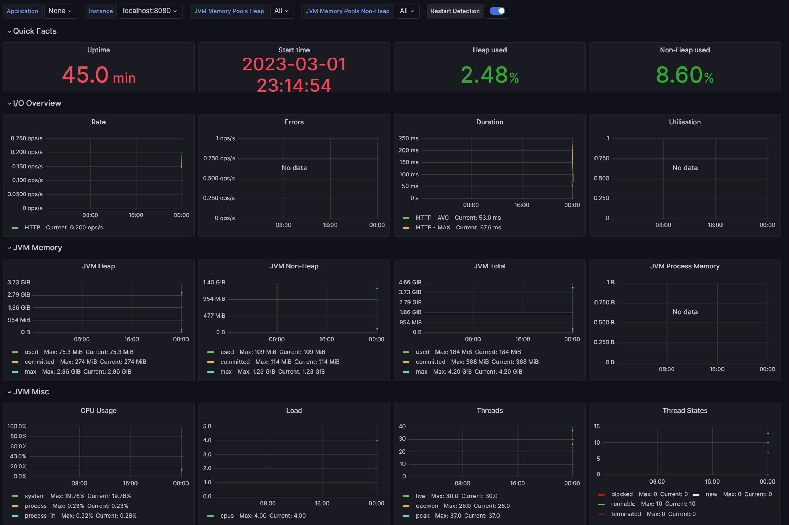

# Grafana & Prometheus 를 이용한 모니터링 시스템 구축

### 📜 개요

 윈도우에서는 작업관리자를 통해 CPU, 메모리 등 시스템 모니터링을 간편하게 할 수 있다. 

리눅스에서는 제공하는 시스템 감시를 사용하거나 터미널 환경에서 사용할 수 있는 htop이 있습니다. 

하지만, 이런 프로그램들은 훨씬 과거의 데이터까지 표시해주지 않는다. 자는 동안 CPU 에 과부하가 걸려도 확인이 어렵다.

### 📜 본문

#### Prometheus와 Grafana를 통해 가능한 것

- 모니터링 데이터 반영구적 저장 가능 (기간-1Y, 5Y, 용량-100GB)
- CPU, 메모리 사용량 같은 시스템 데이터 뿐만 아니라 Django, Docker, Minecraft Server 등 다양한 metrics 저장 가능
- 알림 기능 (시스템에 문제가 생겨 설정한 값 을 넘었을 때 Slack으로 알림 보내기 가능)

#### 아키텍처


- **Prometheus** 는 데이터를 저장하는 DB 이며, Back-end 역할을 함
  - 요청 시간, 데이터베이스 활성 연결 수, CPI 사용량 등 모니터링 가능
  - 일반적으로 다른 모니터링 도구는 서버에 클라이언트를 설치하고 클라이언트가 메트릭 데이터를 수집해서 서버로 보내는 방식으로 동작하는데, Prometheus는 반대로 직접 주기적으로 Pull 해오는 방식으로 동작
- **Grafana** 는 prometheus에 query하여 데이터를 가져오며, Front-end 역할을 함


### 📜 적용

#### 목표

- 스프릉부트 어플리케이션과 관련된 여러 메트릭을 수집**(Prometheus)**하고, 시각화하여 모니터링**(Grafana)**할 수 있는 환경 구축

#### 방법 ([참고](https://hudi.blog/spring-boot-actuator-prometheus-grafana-set-up/))

##### 스프링

1. 의존성 추가

   ```gradle
   implementation 'org.springframework.boot:spring-boot-starter-actuator'
   runtimeOnly 'io.micrometer:micrometer-registry-prometheus'
   ```

2. Prometheus를 위한 엔드 포인트 노출

   - prometheus가 이 엔드포인트에 접속하여, 주기적으로 메트릭 정보를 수집

   **application.yml**

   ```yaml
   management:
     endpoints:
       web:
         exposure:
           include: prometheus // 노출할 엔드포인트
           exclud: // 노출하고 싶지 않은 엔드포인트
   ```

3. `prometheus.yml` 파일 작성

   - `global.scrape_interval` : metric 수집 주기
   - `scrape_configs.static_configs.targets` : metric을 수집할 호스트 정보
   - `scape_configs.static_configs.metric_path` : metric 정보의 경로를 명시

   ```yaml
   global:
     scrape_interval: 15s
   
   scrape_configs:
     - job_name: prometheus
       static_configs:
         - targets: ['<springboot-app-host>:<springboot-app-port>']
   		metric_path: '/actuator/prometheus'
   ```


##### 프로메테우스

1. Prometheus 설치

2. `prometheus.yml` 설정

   ```yaml
   global:
     scrape_interval: 15s
   
   scrape_configs:
       
     - job_name: 'spring-actuator'
       metrics_path: '/actuator/prometheus'
       scrape_interval: 5s
       static_configs:
       - targets: ['localhost:8080']
   ```

3. `prometheus.exe` 을 실행시킨 후, `localhost:9090` 접속

   

##### 그라파나

1. Grafana 설치 (https://grafana.com/grafana/download?platform=windows)
2. `bin/grafana-server.exe` 을 실행시킨 후, `localhost:3000`  접속
3. admin/admin 으로 로그인
4. Data sources > Add data source
   - URL : `http://localhost:9090`
   - `Save & test` 

5. Dashboards > Import

   - Import via grafana.com : `https://grafana.com/grafana/dashboards/4701-jvm-micrometer/ `

   - Prometheus : 방금 추가한 Prometheus 선택



