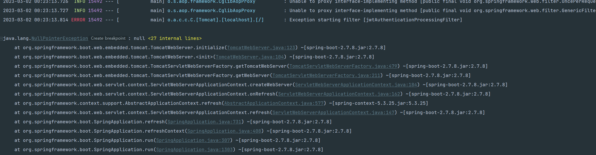

# OAuth2 + JWT 

참고: https://europani.github.io/spring/2022/01/15/036-oauth2-jwt.html

##### 클라이언트가 설정한 콜백 uri 로 리다이렉트하는 방법

- authorizationEndpoint 에서 설정한 requestRepository (`CookieAuthorizationRequestRepository.java`)

  - `redirect_uri` 의 키를 가진 request의 파라미터를 쿠키에 저장해놓음.

  - 로그인 성공 & 실패 핸들러 에서 저장된 uri 로 리다이렉트

    - 실패 때는 error 쿼리를 붙여줌

      (`http://localhost:3000/store?error=noauthorization`)

##### 필터에 @Transactional 을 붙이고 @Component 컴파일 시점? (서버가 켜지는 중) 에 에러 발생

- `@Component` 나 configuration에서 `@Bean` 을 붙이면 위와 같은 에러가 발생했고, 빈 등록을 안하면 서버가 켜졌음.
- 필터에서는 `@Transactional` 이 아닌 repository.save() 와 같이 직접 영속성을 관리해줬음.
- 정확한 이유는 스프링의 구조를 봐야 알겠지만, 우선 Transactional 자체는 프록시로 감싸는 걸로 알고 있는데, 아무튼 담에는 이유를 알 수 있는 사람이 되어보자,,ㅎ
