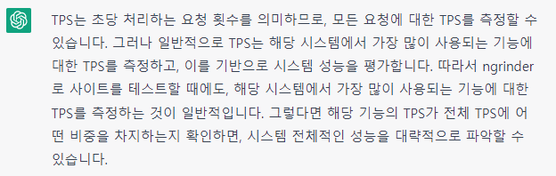
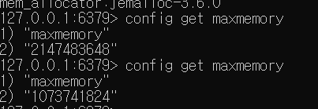

### TPS 측정은 어떤 요청을 기준으로 하는걸까?

##### 해결

- chatGPT에게 물어봄



- 일반적으로 TPS는 해당 시스템에서 가장 많이 사용되는 기능에 대한 TPS를 측정함.

- 실제 사용자의 사용 패턴을 분석하거나, 시스템에서 처리되는 요청의 로그를 분석하여 가장 많은 부하가 걸리는 요청을 파악하고, 그 요처을 대상으로 TPS 측정

- ##### 내 생각

  - 시스템 배포 전에는 가장 부하가 많이 걸릴 요청을 예측해서 TPS를 측정하면 될 것 같고
  - 배포 후에는 구축된 모니터링 시스템을 분석하면서, 실제로 부하가 많이 걸린 요청을 기준으로 측정하면 될 듯
    - 처리 시간의 max가 큰 기능 (수용할 수 있는 최소 트래픽 측정)
    - 급격한 요청 증가가 발생한 기능 (갑자기 트래픽이 몰릴 수 있는 기능이므로, 장애 발생에 대비하여 TPS를 늘리는게 좋을 수 있음)
    - 요청 수가 가장 큰 기능 (많이 사용되는 기능이므로, 여유로운 TPS를 가지고 있으면 좋을 듯)

---

## TPS 측정 설계

##### 상황

- OAuth + JWT 로 인증/인가 가 구현되어 있음
- 가게 리스트, 가게 메뉴 옵션, 주문하기 가 주요 기능임
- 데이터 수가 작아서 실제 TPS 보다 높게 나올 것임

##### 해야할 일

- 인증/인가는 어떻게 할 것인가?
- 더미 데이터 생성
- 테스트
- 

---

## 더미 데이터 생성

https://www.mockaroo.com/

##### mysql 랜덤 정수 

```mysql
SELECT 1+FLOOR(RAND()*10);
```

##### 프로시저로 더미 데이터 생성

```mysql
use baedal;

DELIMITER //

CREATE PROCEDURE generate_store_menu_option_group_dummy_data(IN num_rows INT)
BEGIN
    DECLARE i INT DEFAULT 0;
    
    WHILE i < num_rows DO
        INSERT INTO baedal.store_menu_option_group (is_radio, max, menu_id, min, name, priority)
        VALUES (FLOOR(RAND() + 0.5), FLOOR(RAND() * 10), FLOOR(RAND() * 200000), FLOOR(RAND() * 10), CONCAT('Option Group ', i+1), FLOOR(RAND() * 10));
        SET i = i + 1;
    END WHILE;
END//

DELIMITER ;

call generate_store_menu_option_group_dummy_data(300000);
```


---

## Redis MaxMemory 설정

##### 상황

- Redis 의 상한선이 없다면, 캐싱이 쌓여서 메모리가 터질 수가 있지 않을까 하는 생각에 검색해봄

- 32bit는 디폴트로 값이 설정되어 있다고 하는데, 64bit는 0이라고 함

- `redis.window-service.conf` 파일에서 `maxmemory 1gb` 및 메모리 교체 알고리즘을 설정해줌.

- 하지만 `info memory` 해도 최대 메모리에 대한 정보가 나오지 않았음.

- chatGPT 한테 물어보니 `config get maxmemory`  명령어를 알려줌.

- 하지만, 아무리 conf 파일을 저장해도 0으로 나옴.

- `config get dir` 로 conf의 위치를 보니 내가 생각했던 디렉토리와 달랐음.

- 출력된 디렉토리의 conf 파일을 수정하고 작업관리자>서비스 에서 redis를 다시 실행한 후 확인하니 다음과 같이 잘 출력됨을 볼 수 있었음

  

- 현재는 1GB 로 설정

---

## Argument Resolver 사용

##### 상황

- 로그인이 필요한 서비스에서 accountId는 SecurityContextHolder에 저장되어 있는 Authentication 를 꺼내서 Principal의 userName을 참조했음.
- 필요할 때마다, 위의 로직이 반복되어야 했고, 이는 코드 중복을 일으킴.
- Argument Resolver을 사용해서 accountId 를 꺼내오기 위한 로직을 하나로 통일시키려고 함.

##### 구현

- `supportsParameter()` : 주어진 메소드의 파라미터가 이 Argument Resolver에서 지원하는 타입인지 검사함
- `resolveArgument()` : 이 메소드의 반환값이 대상이 되는 메소드의 파라미터에 바인딩됨.

- ##### 어노테이션 생성

  ```java
  @Target(ElementType.PARAMETER)
  @Retention(RetentionPolicy.RUNTIME)
  public @interface AccountId {
  }
  ```

- ##### ArgumentResolver 생성

  ```java
  public class UserArgumentResolver implements HandlerMethodArgumentResolver {
      @Override
      public boolean supportsParameter(MethodParameter parameter) {
          return parameter.getParameterType().equals(UserDto.class);
      }
  
      @Override
      public Object resolveArgument(MethodParameter parameter, ModelAndViewContainer mavContainer,
                                    NativeWebRequest webRequest, WebDataBinderFactory binderFactory) throws Exception {
          HttpServletRequest httpServletRequest = (HttpServletRequest) webRequest.getNativeRequest();
  
          String token = JwtUtil.extract(httpServletRequest);
          JwtUtil.validateToken(token);
  
          String userId = JwtUtil.getPayload(token);
          String ipAddress = httpServletRequest.getRemoteAddr();
  
          return new UserDto(userId, ipAddress);
      }
  }
  ```

- ##### WebConfig 에 ArgumentResolver 등록

  ```java
  @Override
  public void addArgumentResolvers(List<HandlerMethodArgumentResolver> resolvers) {
      resolvers.add(new AccountIdArgumentResolver());
  }
  ```

  


