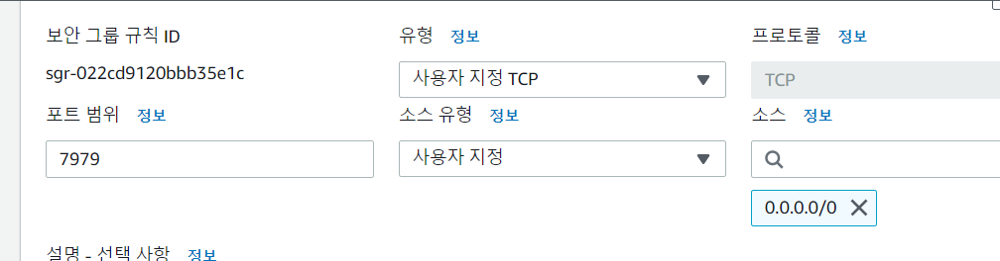
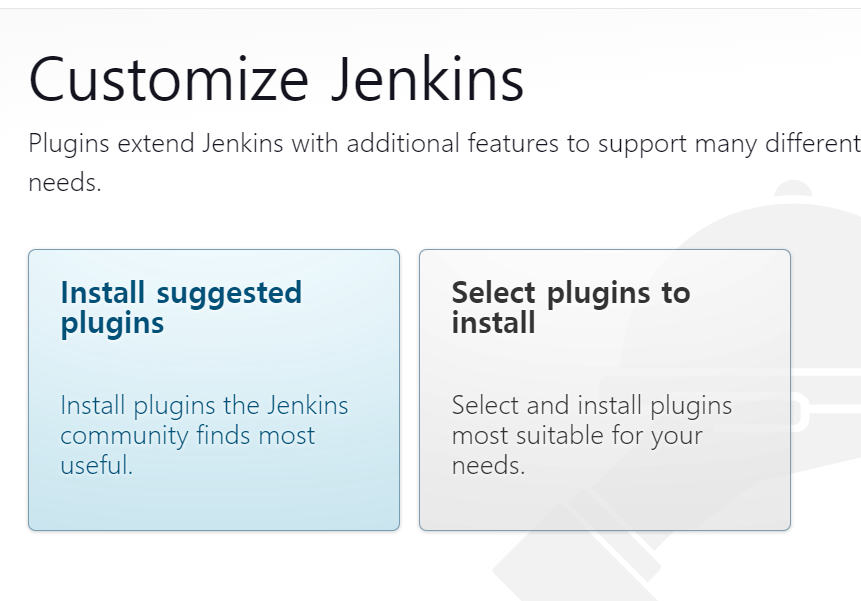

# 1. Docker 설치

```bash
sudo apt install ca-certificates curl gnupg lsb-release -y
sudo mkdir -p /etc/apt/keyrings
curl -fsSL https://download.docker.com/linux/ubuntu/gpg | sudo gpg --dearmor -o /etc/apt/keyrings/docker.gpg
echo "deb [arch=$(dpkg --print-architecture) signed-by=/etc/apt/keyrings/docker.gpg] https://download.docker.com/linux/ubuntu $(lsb_release -cs) stable" | sudo tee /etc/apt/sources.list.d/docker.list > /dev/null
sudo apt update
sudo apt install docker-ce docker-ce-cli containerd.io docker-compose docker-compose-plugin
```


## 2. Jenkins 설치

```bash
sudo docker pull jenkins/jenkins:lts
sudo docker run --name jenkins-docker -p 7979:8080 -p 50000:50000 -d -v /var/run/docker.sock:/var/run/docker.sock -v jenkins_home:/var/jenkins_home -u root jenkins/jenkins:lts
```

##### Host 포트는 뭐고, Container 포트는 무엇인가?

https://blog.naver.com/alice_k106/220278762795


## 3. 컨테이너 접속 후 도커 설치

```bash
docker exec -it jenkins-docker bash
curl https://get.docker.com/ > dockerinstall && chmod 777 dockerinstall && ./dockerinstall
apt install docker-compose

exit # 컨테이너 접속해제 후 진행
sudo chmod 666 /var/run/docker.sock

# 초기 비밀번호 확인
sudo docker logs jenkins-docker
```

- jenkins 에 접속하기 전 보안 그룹에서 포트 열기




## 4. Jenkins 접속

- 초기 플러그인 설치

  

비밀번호: 04063437db5b4f4f89bbde4a5f792e28

## 5. 젠킨스 깃허브 연동

https://2mukee.tistory.com/239

- `github-integration` 플러그인 설치

## 6. 깃허브 웹훅


https://velog.io/@rmswjdtn/Spring-Docker-Github-Action-Spring-Boot-%EC%9E%90%EB%8F%99%EB%B0%B0%ED%8F%AC%ED%99%98%EA%B2%BD-%EB%A7%8C%EB%93%A4%EA%B8%B0
