## 인덱스 설정

#### 기존 설정

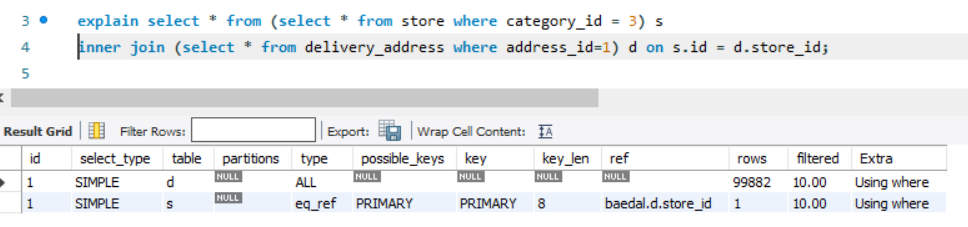


#### delivery_address 인덱스 추가

```java
@Table(indexes = {
        @Index(name = "IX_delivery_address_01",columnList = "addressId")
})
```


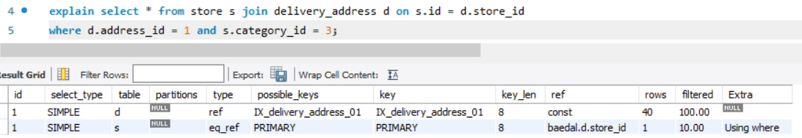

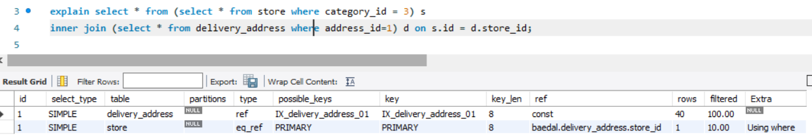


#### store categoryId 인덱스 추가

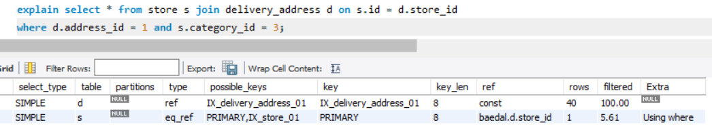

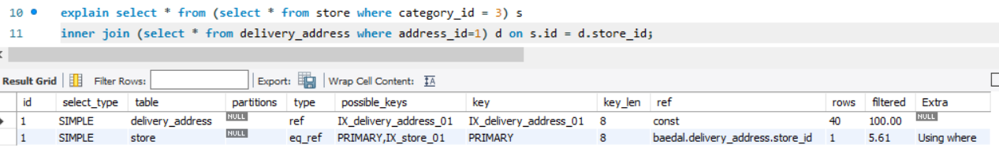


#### 시간 비교

- ##### 인덱스 설정 전

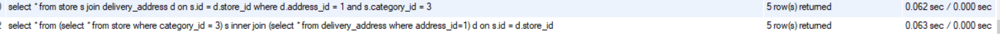

- ##### 인덱스 설정 후

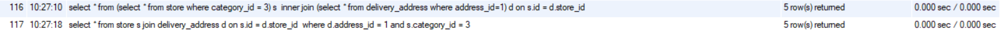


#### 궁금했던 것

- 복합키를 만들면, 그 중 변수 1개만 이용해서 조건 검색해도 인덱스 서칭이 될까?

  - A,B 순으로 복합키를 설정하면, A는 검색이 되지만, B론 검색이 안됨.

- `explain` 했을 때 `filtered` 는 무엇인가?

  > 
  >
  > ##### type
  >
  > type은 접근 방식을 표시하는 필드다. 접근 방식은 테이블에서 어떻게 행데이터를 가져올것인가를 가리킨다. 위 EXPLAIN에서는 ALL, eq_ref, ref가 있는데 ALL, eq_ref는 조인시 기본 키나 고유키를 사용하여 하나의 값으로 접근(최대 1행만을 정확하게 패치), ref는 여러 개의 행을 패치할 가능성이 있는 접근을 의미한다. **접근 방식은 대상 테이블로의 접근이 효율적일지 여부를 판단하는 데 아주 중요한 항목이다.**
  >
  > ##### rows
  >
  > rows는 이 접근 방식을 사용해 몇 행을 가져왔는가를 표시한다. 최초에 접근하는 테이블에 대해서 쿼리 전체에 의해 접근하는 행 수, 그 이후에 테이블에 대해서는 1행의 조인으로 평균 몇 행에 접근했는가를 표시한다. 단 어디까지나 통계 값으로 계산한 값이므로 실제 행 수와 반드시 일치하지 않는다. 
  >
  > ##### filtered
  >
  > filtered는 행 데이터를 가져와 거이에서 WHERE 구의 검색 조건이 적용되면 몇행이 남는지를 표시한다. 이 값도 통계 값 바탕으로 계산한 값이므로 현실의 값과 반드시 일치하지 않는다.


#### 테스트

- address_id , Store_id 순으로 한 것

  1. address_id = 1 인 delivery_address 컬럼을 조회 **(IX_delivery_address_01(address_id) 인덱스 조회)**

  2. 해당 컬럼의 store_id 와 같은 id를 가지고  **(기본키 조회)** category_id=3 **(IX_store_01 인덱스 조회)** 인 store을 조회

     

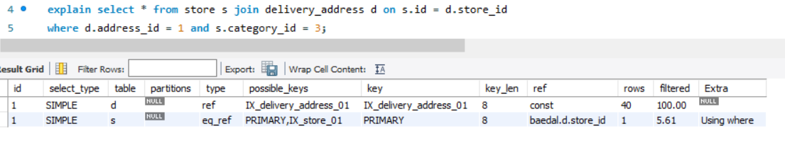

- store_id, address_id 순

  1. category_id=3 **(IX_store_01 인덱스 조회)** 인 store을 조회

  2. 해당 컬럼의 id 와 같은 store_id를 가지고 address_id = 1 인 delivery_address 컬럼을 조회 **(IX_delivery_address_01 조회)**

  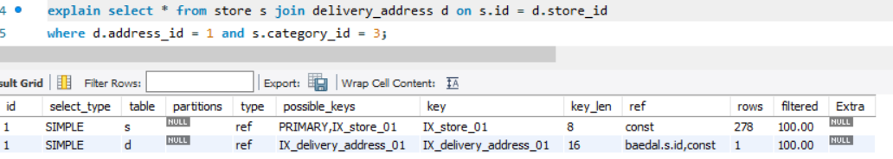

##### 선택 사항

1. `address_id, store_id` 복합키 하나만 설정
   - 장점: 배달 가능 지역을 검색할 때, address_id 검색이 가능하면, 더 빠른 검색이 가능
   - 단점: 특정 가게에서의 회원의 주소에 따른 배달팁을 검색할 때, store_id 를 우선으로 할 때 보단 시간이 더 오래 걸릴 수 있음 (store_id 가 더 선택성 비율이 좋기 때문)
2. `store_id, address_id` 와 `address_id` 두 개의 인덱스 설정
   - 장점: 위의 장단점을 다 해결 가능
   - 단점: 가게 등록/수정 할 때 인덱스 정리 때문에 오래 걸릴 수 있음.

=> 가게 등록/수정 요청 보단 읽기 요청이 훨씬 많이 일어나므로 2번 선택

---

# Redis Config 필요성

##### 상황

- Redis Config 을 따로 추가하지 않아도 캐싱이 잘됐음.
- 추가하면 어떻게 다른지 확인할 것

##### 해결

- Java 의 serializable 을 사용하면 **클래스 구조 변경 시 역직렬화 문제**, **용량 문제** 가 발생한다고 함.
- GenericJackson2JsonRedisSerializer을 사용해도 클래스 변경시 문제가 발생한다고 함.
- 이건 나중에 develop으로 남겨두고 우선은 기존의 방식대로 구현할 것.

https://velog.io/@hkyo96/Spring-RedisTemplate-Serializer-%EC%84%A4%EC%A0%95


---

# AWS RDS 

- MySQL을 AWS RDS 로 사용할 예정
- 인스턴스를 생성한 후, workbench로 접속하니 connection이 안됨
- https://durian9s-coding-tree.tistory.com/15
- 위의 링크를 참조해서 해결

##### 해결 요약

- 해당 RDS 의 보안 그룹을 선택한 후 인바운드 규칙을 다음과 같이 편집한다
- 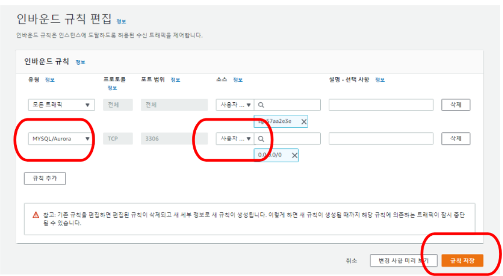


---

# EC2 서버

1. EC2 인스턴스 생성

2. mobaXterm 설치 (username: `ec2-user`)

3. SWAP 통해서 메모리 늘리기

   ##### 방법

   - 스왑 파일 생성

     ```bash
     $ sudo dd if=/dev/zero of=/swapfile bs=128M count=16
     ```

   - 스왑 파일에 대한 읽기 및 쓰기 권한을 업데이트

     ```bash
     $ sudo mkswap /swapfile
     ```

   - Linux 스왑 영역을 설정

     ```bash
     $ sudo swapon /swapfile
     ```

   - 스왑 공간에 스왑 파일을 추가하여 스왑 파일을 즉시 사용할 수 있도록 만듦

     ```bash
     $ sudo swapon -s
     ```

   - 절차가 성공했는지 확인

     ```bash
     $ sudo vi /etc/fstab
     ```

   - /etc/fstab 파일을 편집하여 부팅 시 스왑 파일을 활성화 (다음을 추가하고 저장)

     ```
     /swapfile swap swap defaults 0 0
     ```

   - free를 입력하여 메모리 확인하기

   ##### 기존

   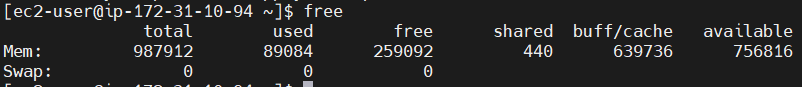

   ##### 적용 후 (Swap 이 2GB 추가된 것을 볼 수 있음)

   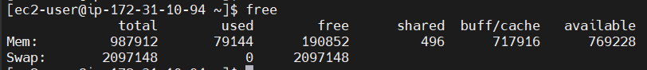

4. 배포하기

   배포 md 에 자세히 적어둠.

#### 	dockerFile와 docker-compose.yml 의 차이

- Dockerfile은 사용자가 이미지를 어셈블하기 위해 호출할 수 있는 명령이 포함된 간단한 텍스트 파일
- Docker Compose는 다중 컨테이너 Docker 애플리케이션을 정의하고 실행하기 위한 도구
  - 앱이 실행되는 동안 컨테이너를 관리하는 역할
  - 앱이 시작되면 컨테이너를 띄우고 앱이 실행되는 중에 컨테이너가 종료되면 다시 띄워줌


---

