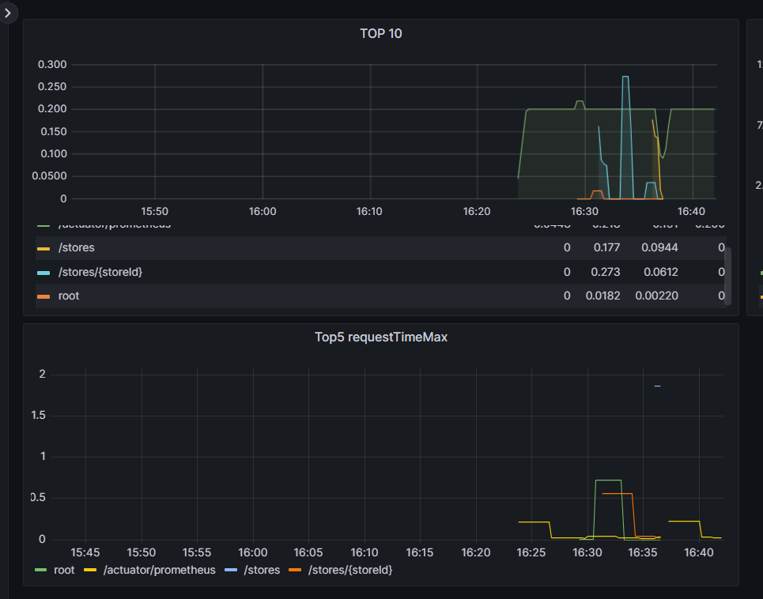

## 모니터링

1. ##### Prometheus

   - target 주소 바꾸기

```yaml
global:
  scrape_interval: 15s

scrape_configs:
  - job_name: "prometheus"

    static_configs:
      - targets: ["localhost:9090"]
    
  - job_name: 'spring-actuator'
    metrics_path: '/actuator/prometheus'
    scrape_interval: 5s
    static_configs:
    - targets: ['13.125.242.100:8080']
```


##### 가장 requestTime 이 큰게 무엇일까라는 궁금증으로 패널 추가

- `TopK(5,http_server_requests_seconds_max)` 로 쿼리 추가


