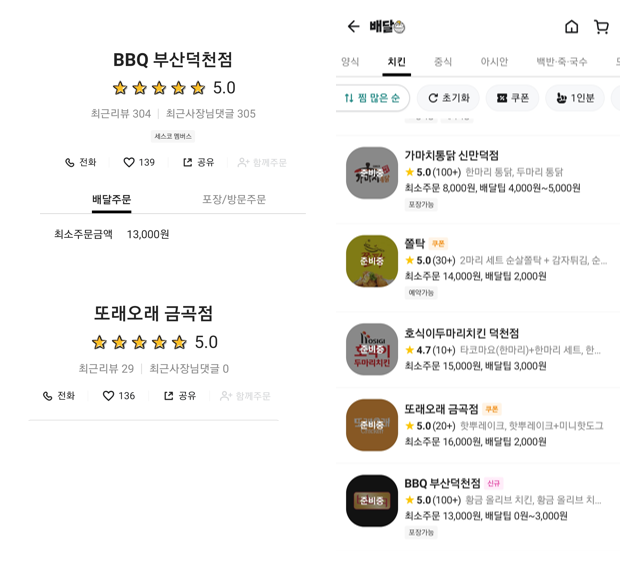

# OAuth2 + JWT 

참고: https://europani.github.io/spring/2022/01/15/036-oauth2-jwt.html

##### 클라이언트가 설정한 콜백 uri 로 리다이렉트하는 방법

- authorizationEndpoint 에서 설정한 requestRepository (`CookieAuthorizationRequestRepository.java`)

  - `redirect_uri` 의 키를 가진 request의 파라미터를 쿠키에 저장해놓음.

  - 로그인 성공 & 실패 핸들러 에서 저장된 uri 로 리다이렉트

    - 실패 때는 error 쿼리를 붙여줌

      (`http://localhost:3000/store?error=noauthorization`)

##### 필터에 @Transactional 을 붙이고 @Component 을 붙여서 빈등록을 하면 서버 부팅 중에 에러 발생

- `@Component` 나 configuration에서 `@Bean` 을 붙이면 위와 같은 에러가 발생했고, 빈 등록을 안하면 서버가 켜졌음.
- 필터에서는 `@Transactional` 이 아닌 repository.save() 와 같이 직접 영속성을 관리해줬음.
- 정확한 이유는 스프링의 구조를 봐야 알겠지만, 우선 Transactional 자체는 프록시로 감싸는 걸로 알고 있는데, 아무튼 담에는 이유를 알 수 있는 사람이 되어보자,,ㅎ

---

## 좋아요 정렬을 커서기반 페이지네이션 으로 구현하면 성능이 괜찮을까?

##### 상황

##### 커서 기반 페이지네이션을 선택하게 된 이유

- 오프셋 기반 페이지네이션은 앞에 컬럼이 추가되면 중복된 데이터를 또 출력하는 문제가 발생하고, 오프셋이 100000이상일 경우 그 만큼을 스캔해야 함.
- 그런 문제점 때문에 커서 기반 페이지네이션으로 구현하기로 함.
- id 정렬은 id가 primary로 인덱스설정이 기본적으로 되어 있기 때문에, 커서기반으로 구현했을 때 큰 이득을 볼 수 있음.
- 커서기반 페이지네이션은 조회한 마지막 인덱스를 기준으로 보기 때문에 데이터가 중복되지 않는다. 

##### 커서 기반 페이지네이션이 옳은걸까 의심이 생기는 이유

- 중간에 갑자기 좋아요가 변경이 된다면 순서가 뒤바껴서 출력이 이상해질 수도 있지 않을까?

- 좋아요와 같은 unique하지 않은 필드는 where과 or을 사용해서 같은 좋아요수를 구분해야하는데, 이는 인덱스를 타지 않기 때문에 `0000{like}0000{id}` 와 같이 커스텀 필드를 줌으로써 해결해야 하고, 인덱스의 이점을 이용하기 위해선 이와 같은 가상 필드를 둠으로써 커스텀 인덱스를 설정해야 함.

  - 하지만, like와 같이 변동이 큰 건 인덱스를 설정하면 오히려 성능이 떨어질 수 있음.

  - 그리고 0으로 패딩을 주면 데이터 길이에 대해 확장성이 떨어짐.

  - 인덱스를 두지 않고, where로 조건을 건 후 sort하면 sort할 땐 기존의 방법보단 시간복잡도의 이점을 볼 수 있을 것 같은데, 대용량 데이터일 경우 인덱스는 거의 필수라고 생각함.

  - 배민은 어떻게 하는지 보았음.

    - 실제 찜 수와 순서가 일치하지 않았음.
    - 배치 등을 이용해서 하지 않았을까,,? 싶음

    

- 네이버 맛집을 봤을 땐 리뷰수나 별점에 따라 정렬하는 필터가 없음.
- 지니 앱을 봤을 땐 좋아요 순이 없음 -> `인기순` 이 있는데 교묘하게 이용자 입장에서는 객관적으로 확인할 수 없는 순서라서 실시간성이 보장되지 않아도 됨.
- 결론은 실시간성을 보장하지 않기 위해서 찜을 안에 숨겨넣던지 인기순이라고 하던지 교묘한 눈속임을 하는 듯
  - 서비스에선 높은 정확도보단 ux 성능이 중요할 수 있음. 
  - 성능이 좋지 않은 기능은 없느니만 못함.

---

## Cors 에러

##### 상황

- 로컬에선 됐는데, EC2 에 올려서 그런건진 모르겠는데 갑자기 FE에서 cors 에러가 발생한다고 함

##### 해결

- setCredential 을 true로 해줘서 해결된건강 아무튼 해결~
- postman으로도 cors를 확인할 수 있는걸 처음 알게 됨. header에 Origin 으로 `localhostr:3000` 을 넣으니까 확인이 됨

---

## MSA에서 인증/인가

- API gateway 에서 인증 인가를 하려고 함.
- 하지만, 데이터 액세스 레이어가 존재해야 하는데, 이건 gateway에서 분리해야 할 것 같아 찾아봄
- 찾아보니, 보통 jwt는 gateway에서 확인하고, 로그인과 같은건 user-service 마이크로 서비스오 책임을 전가하는 거 같음
- 그런데 jwt 에 있는 username이 실제론 없는 userId일 수도 있음.
- 이걸 확인하기 위해선 user 마이크로 서비스에 요청을 보내야 하는데, 이렇게 한게 있는지 레퍼런스를 찾아봄

##### 해결

- userService에서 확인하는건 마이크로서비스에게 책임을 전가하기로 했다.
- gateway에서는 오로지 jwt만 보고 유효한 것인지만 보고 이후에 userId를 이용한 기능은 직접 user-service과 통신함으로써 회원 유무를 확인하기로 했다.

##### 주의

- 마이크로서비스들이 외부에 노출되지 않도록 방화벽 설정 확실히 해두기!

---

## JPA Buddy 완전 편하네?

- JPA 처음했을 때 Buddy 플러그인이 계속 뜨길래 아무생각없이 설치는 했었는데, 딱히 사용을 해본 적은 없었음.
- msa하다가 어쩌다 봤는데, validation도 엄청 간편하고, jpa method, query 짤 때도 엄청 편해보이는 듯,,?
- 앞으로는 잘 이용해보자~
