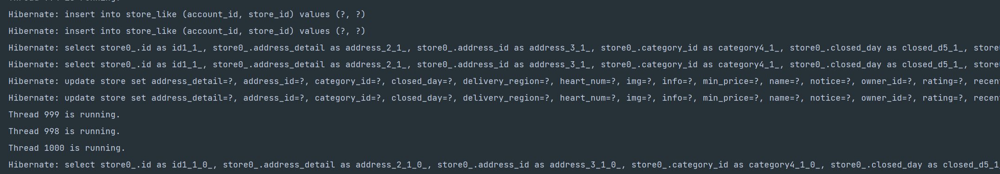
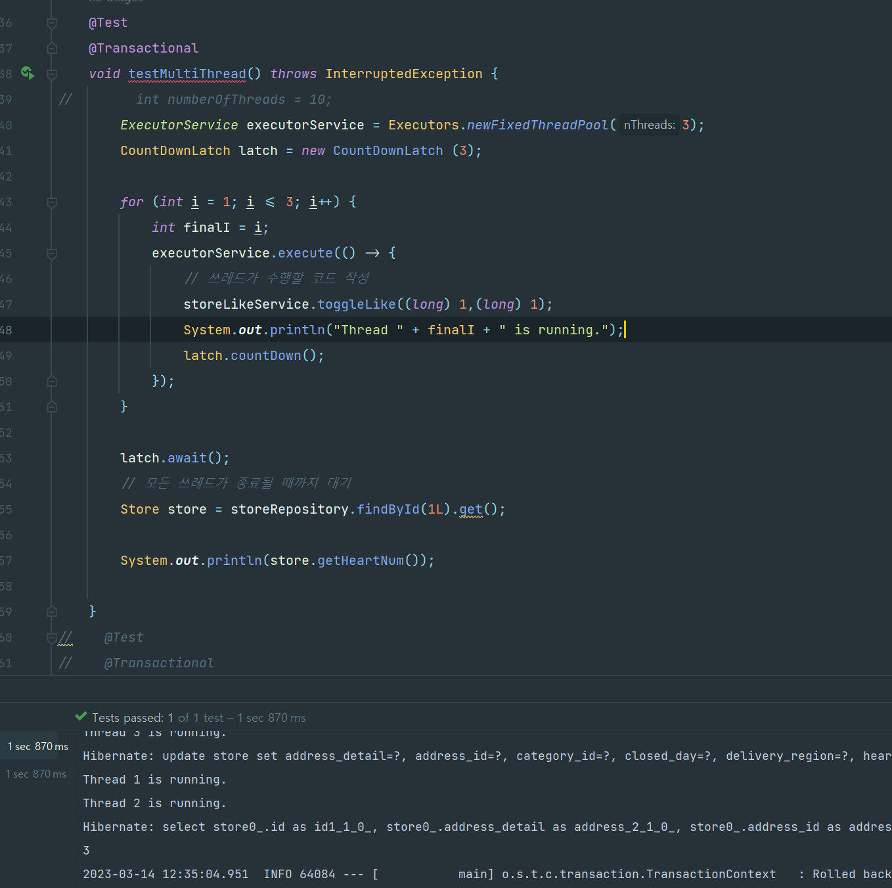
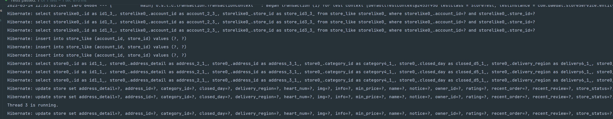

## 멀티쓰레드 테스트를 하는데 롤백이 안돼요ㅜ

##### 상황

- 다음과 같이 테스트 코드를 작성하고 테스트를 돌렸다.
- 하지만 롤백이 안된다!!!!!!!!!!!!!!
- 멀티쓰레드말고 싱글쓰레드로만 하면 롤백이 되는데, 멀티쓰레드를 쓰는 순간부터 아무리 어떻게 해도 안된다,,
- 그리고 stackoverflow나 다 찾아봐도 잘 안나온다ㅜㅜ
- 그나마 가능성이 높은건 `@Transactional` 은 멀티쓰레드를 지원하지 않는다. 인듯

```java
@SpringBootTest
class StoreTest {

    @Autowired
    StoreRepository storeRepository;

    @Autowired
    StoreLikeService storeLikeService;

    @Test
    @Transactional
    void testMultiThread() throws InterruptedException {
//        int numberOfThreads = 10;
        ExecutorService executorService = Executors.newFixedThreadPool(5);
        CountDownLatch latch = new CountDownLatch (5);

        for (int i = 1; i < 6; i++) {
            int finalI = i;
            executorService.execute(() -> {
                // 쓰레드가 수행할 코드 작성
                storeLikeService.toggleLike((long) finalI,1L);
                System.out.println("Thread " + finalI + " is running.");
                latch.countDown();
            });
        }

        latch.await();
        // 모든 쓰레드가 종료될 때까지 대기
        Store store = storeRepository.findById(1L).get();

        System.out.println(store.getHeartNum());

    }

}
```


---

## 동시성 해결하기

### 1. synchronized

##### Synchronized

- `@Transactional` 이랑 호환안됨
- 단점: 멀티 서버에선 안됨, 테이블별 lock

### 2. row 별 lock

- 다른 storeId 에 대해선 병렬적으로 연산이 가능해서 성능이 개선되지 않을까


##### 1번과 2번 성능 테스트

- 1000개의 데이터에서 accountId, storeId 가 증가하도록 하고 toggleLike를 했음

  ```java
      @Test
      @Transactional
      void testMultiThread() throws InterruptedException {
  //        int numberOfThreads = 10;
          ExecutorService executorService = Executors.newFixedThreadPool(10);
          CountDownLatch latch = new CountDownLatch (1000);
  
          for (int i = 1; i <= 1000; i++) {
              int finalI = i;
              executorService.execute(() -> {
                  // 쓰레드가 수행할 코드 작성
                  storeLikeService.toggleLike((long) finalI,(long) finalI);
                  System.out.println("Thread " + finalI + " is running.");
                  latch.countDown();
              });
          }
  
          latch.await();
          // 모든 쓰레드가 종료될 때까지 대기
          Store store = storeRepository.findById(1L).get();
  
          System.out.println(store.getHeartNum());
  
      }
  ```

  

##### 결과

- 1번: 약 50초 (12:14:46.694 - 12:15:36.909)

- 2번: 약 21초 (12:19:45.991 - 12:20:06.977)

  - 그리고 row별 lock 방법은 쓰레드가 병렬적인걸 알 수 있음

  

##### 결론

1번은 synchronized로 되어 있어서 멀티쓰레드라도 무조건 싱글쓰레드로만 동작 -> A, B 사용자가 각각 다른 가게를 찜해도 싱글스레드로 동작해서 병목현상이 발생할 수 있음
2번은 row별 lock으로 동작 -> 다른 가게 찜하면 병렬적으로 멀티쓰레드 처리, 동일 가게만 싱글스레드 느낌?


---

## 동일한 사용자가 좋아요를 빠르게 눌르면?

##### 상황

- synchronized를 안썼기 때문에 동일한 사용자가 좋아요를 누르면 동시성 문제가 발생할 수도 있을 것 같아 테스트를 해봤다.
- 역시나 다음과 같이 동일한 사용자라도 쌓였다.



##### 이유 분석

- 역시 예상한대로, 좋아요 체크를 동시에 진행하기 때문에, 첫번째 직업이 추후 좋아요가 성공적으로 완수되어도, 다른 스레드에선 이미 체크는 지났기 때문에 중복된다.




#### 해결 방법 모색

1. storeLike 에서도 lock을 추가
   - storeLike에선 참조되는 row가 없어서 그런지 모르겠는데 


---

## 트랜잭션 전파

https://deveric.tistory.com/86


---

```java
Hibernate: select user0_.id as id1_1_, user0_.created_at as created_2_1_, user0_.modified_at as modified3_1_, user0_.account as account4_1_, user0_.password as password5_1_, user0_.username as username6_1_ from user user0_ where user0_.account=?
    
Hibernate: insert into user (created_at, modified_at, account, password, username) values (?, ?, ?, ?, ?)
    
Hibernate: select user0_.id as id1_1_, user0_.created_at as created_2_1_, user0_.modified_at as modified3_1_, user0_.account as account4_1_, user0_.password as password5_1_, user0_.username as username6_1_ from user user0_ where user0_.account=?
    
Hibernate: select user0_.id as id1_1_, user0_.created_at as created_2_1_, user0_.modified_at as modified3_1_, user0_.account as account4_1_, user0_.password as password5_1_, user0_.username as username6_1_ from user user0_ where user0_.account=?
    
Hibernate: insert into post (created_at, modified_at, content, title, user_id) values (?, ?, ?, ?, ?)
    
Hibernate: select post0_.id as id1_0_0_, post0_.created_at as created_2_0_0_, post0_.modified_at as modified3_0_0_, post0_.content as content4_0_0_, post0_.title as title5_0_0_, post0_.user_id as user_id6_0_0_, user1_.id as id1_1_1_, user1_.created_at as created_2_1_1_, user1_.modified_at as modified3_1_1_, user1_.account as account4_1_1_, user1_.password as password5_1_1_, user1_.username as username6_1_1_ from post post0_ left outer join user user1_ on post0_.user_id=user1_.id where post0_.id=?

```

