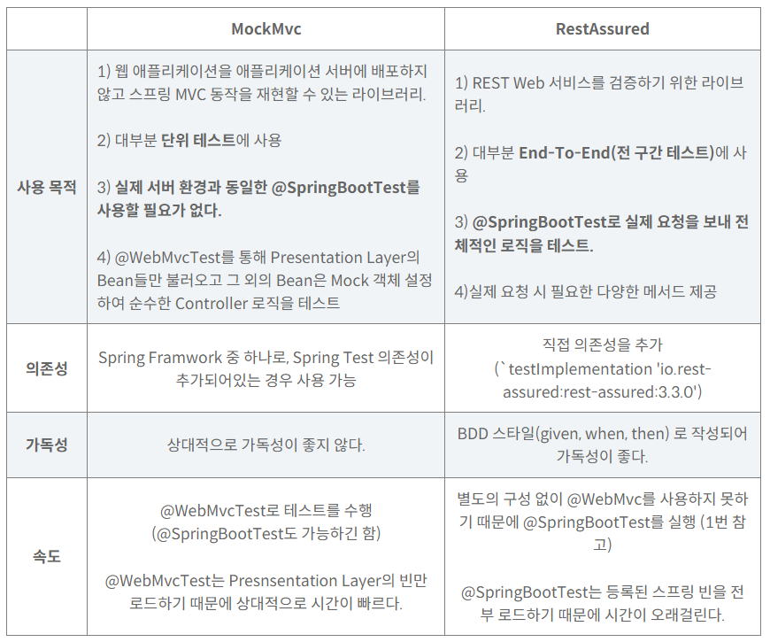

- ## 코틀린

  - 코틀린 재미따, 파이썬이랑 타입스크립트랑 자바랑 섞은거 같당

  ##### 배열 입력

  ```java
  val st = StringTokenizer(readLine())
  
      while (st.hasMoreTokens()) {
          arr.add(st.nextToken().toInt())
      }
  
  val (x, y) = readln().split(" ").map { it.toInt() }
          dots.add(Dot(x, y))
  ```

  

  ---

  ## Redisson 을 사용해서 좋아요수 동시성 처리하기

  - 동일한 사용자가 동시에 좋아요를 눌리는 경우를 처리하기 위해서 하려고 했음
  - 클라이언트에서 충분히 처리가 가능할거같아서 취소~
  - 추가로 DB Lock 과 redisson 의 장단점을 찾아봄

  #### MySQL user-level

  **장점**
  1.redisson을 이용할 때보다 MySQL user-level의 분산락을 이용하는게 빌드 속도가 더 빠름
  2.추가 DB에 대한 비용 발생 X
  3.선언적 트랜잭션 사용 가능(@Transcational)

  **단점**
  1.별도로 스레드를 생성해서 락을 걸어줘야 하는 단점

  - 1개의 스레드(요청) - 1개의 lock이 걸리도록 동작해야 하므로

  #### Redisson

  **장점**
  1.구현이 편리
  2.가독성 좋은 코드

  **단점**
  1.빌드 시 지연 발생(MySQL user-level의 분산락이 더 빠름)
  2.추가 DB이므로 비용 발생.

  - 캐싱 등 redis의 기능을 적극 활용한다면 비용이 아깝지 않겠지만, 분산락만 이용한다면 아깝지 않을까...
    3.선언적 트랜잭션 사용 불가
  - TranscationManager를 이용해서 별도의 트랜잭션 작업 처리 해줘야 함

  

  ---

  ## MockMvc VS RestAssured

  - Controller을 테스트하기 위해서 RestAssured 사용

  

  

  ---

  ## MySQL 성능 최적화

  #### 인덱스 실행 계획

  ##### 풀스캔을 하는 경우 (all)

  - 인덱스가 없어서
  - 인덱스가 있지만, 데이터 전체 갯수가 많지 않거나 읽고자 하는 데이터가 전체 데이터의 25%가 넘어갈 때

  ##### range

  - 인덱스를 잘 걸었을 때

  ##### index

  - index 풀 스캔: Full Scan보단 좋지만 index range 성능보단 좋지 않음

  #### 어느 컬럼에 인덱스를 걸어야 할까?

  1. 서비스의 특성상 무엇에 대한 조회가 많이 일어나는지 파악
  2. 카디널리티(다양성)가 높은 칼럼에 대해 인덱스를 생성

  

  #### 커버링 인덱스

  - 인덱스로 설정한 칼럼만 읽어 쿼리를 모두 처리할 수 있는 익덱스
  - 불필요한 디스크 I/O 를 줄여 조회 시간 단축
  - `Index Range Scan` 발생 (Extra 컬럼에 `Using index`)

  #### Extra 칼럼의 Using where

  - InnoDB 스토리지 엔진을 통해 테이블에서 행을 가져온 뒤, MySQL 엔진에서 추가적인 체크 조건을 활용하여 행의 범위를 축소한 것

  Extra 칼럼의 인덱스 컨디션 푸시다운

  - Using Index Condition은 인덱스 컨디션 푸시다운으로 인해 표시
  - 인덱스 컨디션 푸시다운이란, MySQL이 인덱스를 사용하여 테이블에서 행을 검색하는 경우의 최적화를 의미
  - ICP를 확성화하고 인덱스의 칼럼만 사용하여 Where 조건의 일부를 평가할 수 있는 경우 MySQL 엔진은 where 조건 부분을 스토리지 엔진으로 푸시

  

  ---

  ## profiles group

  ##### 상황

  - 테스트에서는 배포와 다른 db를 사용
  - 테스트용 hide 설정을 따로 작성하고 profile이 test일 땐 기존의 hide파일이 아닌 테스트용 hide 파일이 활성화되게 하고 싶었음.

  ##### 해결

  - 기존의 include는 없애고, group으로 대체

    ```yaml
    spring:
      profiles:
        group:
          prod:
            - prod
            - hide
          dev:
            - dev
            - hide
          test:
            - test
            - testhide
    ```

    
