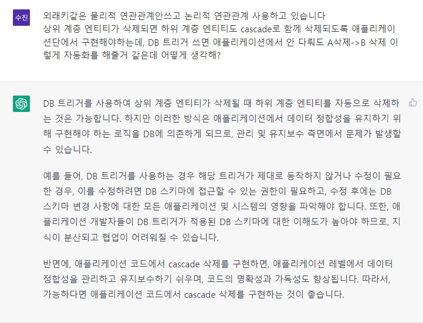

## 데이터베이스 트리거

##### 상황

- 난 논리적 연관관계를 쓰고 있음.
- 상위계층의 엔티티가 삭제될 때 하위계층의 엔티티도 삭제되도록 해야하는데, 이는 애플리케이션 단계에서 설정해야함.
- 데이터베이스 트리거를 이용하면 할 수 있지 않을까?

---

## VO vs DTO

- ##### 첫번째 설명

DTO a = new DTO(1);

DTO b = new DTO(1);

이라고 했을때, a != b 이지만,

VO a = new VO(1);

VO b = new VO(1);

이라고 했을때 a == b 라고 정의하는 형태

- ##### 두번째 설명

제가 설명을 잘 못한거 같아서 추가 설명을 더해 보겠습니다. 

Integer 를 보면,

Integer a = new Integer(1);

Integer b = new Integer(1);

a == b 입니다. 

값 차체로 의미가 있는 것들이  VO 입니다.

- 색상으로 하면 빨간 색은 어딜 가도 빨간색입니다.
- 돈으로 따지면  100원 이면 어딜 가도 100원 입니다.
- 숫자로 따지면 10 은 어딜 가도 10 입니다.

Value Object 어느 상황에도 **동일하게 취급 되는 게 핵십**입니다.

## 
