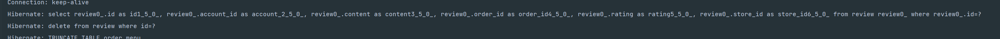
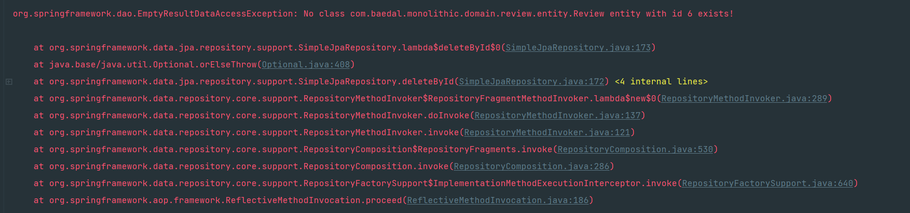
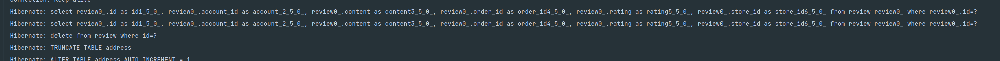
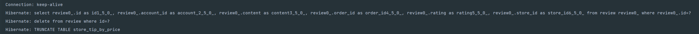

## Delete 로직에 Transactional이 필요할까?

##### deleteById

- 존재하는 Id로 쿼리를 날리면 다음과 같이 쿼리 1개만으로 처리가 됨

  

- id가 존재하지 않으면 다음의 `EmptyResultDataAccessException` 에러 발생

  

- 다음과 같은 예외 처리 추가

  - `EmptyResultDataAccessException` 을 커스텀 리뷰 예외가 날아가게 예외 핸들링

  - ##### 테스트코드

    - 테스트 성공

    ```java
    @Test
    @DisplayName("존재하지 않는 리뷰를 삭제하면 예외가 발생한다")
    void 리뷰_삭제() throws InterruptedException  {
        Assertions.assertThrows(RuntimeException.class, () -> {
            reviewService.deleteReview(6L);
        });
    }
    ```

  - 하지만, deleteById 내부에 어차피 findById가 존재하고 deleteById는 Lock으로 감싸져 있지 않기 때문에, 동시성 문제가 똑같이 발생함.
  - 따라서 결국은 findById -> delete 한 걸 묶어주는거랑 똑같음.

  

  ```java
  @Transactional
  public void deleteReview(Long reviewId) {
      try {
  //            reviewRepository.delete(reviewRepository.findById(reviewId).orElseThrow(()->new ReviewException(ReviewStatusCode.NO_ORDER)));
          reviewRepository.deleteById(reviewId);
      } catch (EmptyResultDataAccessException e){
          throw new ReviewException(ReviewStatusCode.NO_REVIEW);
      }
  }
  ```

  

##### delete

- findById -> delete 를 `@Transactional` 로 감싸지 않으면, 1차 캐시에 저장되어 있지 않기 때문에 쿼리를 또 날림

- `@Transactional` 을 붙였을 때는 다음과 같이 쿼리 한개만 날림

  

- 하지만, 이 경우 동시성 문제가 발생할 수 있음.
  - 이를 위해 Lock을 거는 방법이 있고
  - try-catch 로 그냥 예외처리해도 되지 않을까 하는 내 뇌피셜도 있음.
