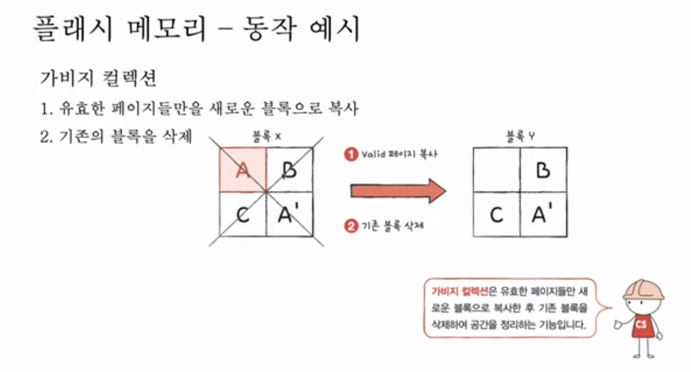

## 데이터 접근 과정 소요 시간





 


## Collections의 addAll

#### ArrayList

```java
public boolean addAll(Collection<? extends E> c) {
        Object[] a = c.toArray();
        modCount++;
        int numNew = a.length;
        if (numNew == 0)
            return false;
        Object[] elementData;
        final int s;
        if (numNew > (elementData = this.elementData).length - (s = size)) // 남아있는 데이터의 크기가 모자라면 배열을 키움
            elementData = grow(s + numNew); // 배열복사
        System.arraycopy(a, 0, elementData, s, numNew);
        size = s + numNew;
        return true;
    }

```

```java
private Object[] grow(int minCapacity) {
        return elementData = Arrays.copyOf(elementData,
                                           newCapacity(minCapacity));
    }
```


#### LinkedList

- 링크드 리스트의 addAll은 c가 링크드 리스트라면 O(1) 일줄 알았으나, 실제 구현체에선 Collections를 링크드리스트로 변환하는 과정이 있어서 O(n) 임을 확인했다.

```java
public boolean addAll(int index, Collection<? extends E> c) {
        checkPositionIndex(index);

        Object[] a = c.toArray();
        int numNew = a.length;
        if (numNew == 0)
            return false;

        Node<E> pred, succ;
    
    // 끝에 추가하는지 중간에 추가하는지에 따라 분기
        if (index == size) {
            succ = null;
            pred = last;
        } else {
            succ = node(index);
            pred = succ.prev;
        }

    // 추가하는 배열을 링크드리스트로 변환
        for (Object o : a) {
            @SuppressWarnings("unchecked") E e = (E) o;
            Node<E> newNode = new Node<>(pred, e, null);
            
            // 처음에 추가
            if (pred == null)
                first = newNode;
            else
                pred.next = newNode;
            pred = newNode;
        }

    // 마지막에 추가
        if (succ == null) {
            last = pred;
        } else {
            pred.next = succ;
            succ.prev = pred;
        }

        size += numNew;
        modCount++;
        return true;
    }
```

