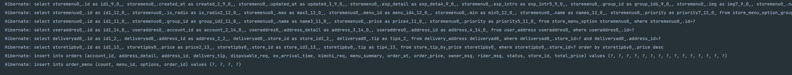
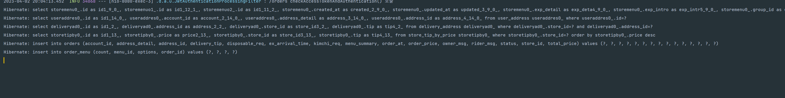

## 가비지 컬렉터

- FGC가 자주 발생하면 성능 저하가 일어남
- Heap dump 모니터링을 통해 어떤 객체에 대한 gc가 많이 일어나는지를 확인하고, 문제를 해결할 것

##### 예시

```java
String url = apiUrl + "/find/" + req.getId();
try {
    res = restTemplate.getForObject(url, ApiResponse.class);
} catch (Throwable t)
```

- servo metrics가 url pattern을 고유한 키로 수집하는데, 위의 코드는 id에 따라 url이 계속 변경되면서, 메모리가 쌓이는 것

##### 해결 방법

```java
String url = apiUrl + "/v1/orders/;
try {
    res = restTemplate.getForObject(url, ApiResponse.class, id);
} catch (Throwable t)
```

- 위와 같이 pathVariable 부분에 id를 바인딩해서 할당해주면 servo metrics 수집에서 문제가 발생하지 않음.

##### 정리

- memory Leak가 발생하지 않도록!


## 힙 스택

##### 스택

- 원시 타입의 데이터가 값과 저장
- Heap 영역에 생성된 Object 타입의 데이터 참조값이 저장
- 함수가 호출될 때 사용하는 메모리이고 기능 수행이 끝나면 자동으로 반환되는 메모리

##### 힙

- Object 타입의 데이터가 저장 (String, Integer 등)
- 애플리케이션의 모든 메모리 중 Stack을 제외한 부분
- 자동으로 관리되지 않은 메모리 영역
- CG가 관리해줌

##### 가비지 컬렉터

```java
String url = "www.naver.com";
url += "/search";
```

- url 참조값이 변경되면서 `"www.naver.com"`는 unreachable Object가 됨
- ` unreachable Object` : Stack 에 도달할 수 없는 Heap 영역

- 가비지 컬렉터는 unreachable Object를 힙 영역에서 제거


---

## DB 인덱싱을 하는 이유와 원리 + 내부구조

https://rebro.kr/169

- 주소록을 구현하려고 해도 B-Tree로 구현해야 함.
- B+Tree가 서칭할 땐 B-Tree보단 낫지만, 업데이트할 땐 오히려 분리
- 커널을 가지는건 : OS, DB

- index는 Ram에 저장되어있음 (data는 HDD)

---

## db에서 Join vs 애플리케이션에서 조합

#####  상황

- db에 join 쿼리를 날려서 한번에 조회하려고 하는데, 애플리케이션에서 조합하는게 더 나은 선택지인지 검색해보았다.

##### 서칭

- 둘다 해보고 비교해봐라~

---

## HashMap 변환 주체 바꾸기

##### 상황

- 가격계산을 할 때, 메뉴와 옵션 쿼리를 하나로 합친 후 map으로 바꿔서 계산하려고 했음
  - 주문 리스트와 메뉴 리스트 둘 다 리스트이기 때문에, n^2 이기 때문이다.
- 재사용성을 위해 메뉴 리스트를 Map으로 바꾸지 말고, 주문 리스트를 Map으로 바꾸려고 함.
  - 메뉴 리스트는 find할 때도 사용되는데, priority에 따라 순서가 중요하기 때문에, 반환타입이 List여야 재사용할 수 있음.
- 

#### => 그냥 Dto로 join해서 조회 쿼리 날려서 1차 캐싱한 후 접근하면 안될까?

- 아래와 같이 join을 통해 1개의 쿼리로 모든 엔티티를 조회함.

```java
// StoreMenuRepository.java  
@Query("SELECT m, og, o FROM StoreMenu m " +
        "INNER JOIN StoreMenuOptionGroup og " +
        "ON m.id=og.menuId " +
        "INNER JOIN StoreMenuOption o " +
        "ON og.id=o.groupId " +
        "WHERE m.id IN :ids")
List<Object[]> findMenusByIdIn(@Param("ids") List<Long> ids);
```

##### 결과

- 이전(시간:140ms)

  

- 이후 (시간:91ms)

##### 결론

- 예상한 대로 1차 캐싱이 되고, 따로 쿼리가 안나간다.
- DB 조인 쿼리를 날림으로써, DB 커넥션의 수는 줄이지만 DB 에 부하를 줄 수도 있음. 인덱스가 설정이 되어 있어서 괜찮지 않을까 싶긴하지만, 나중에 테스트해보면 좋을듯
