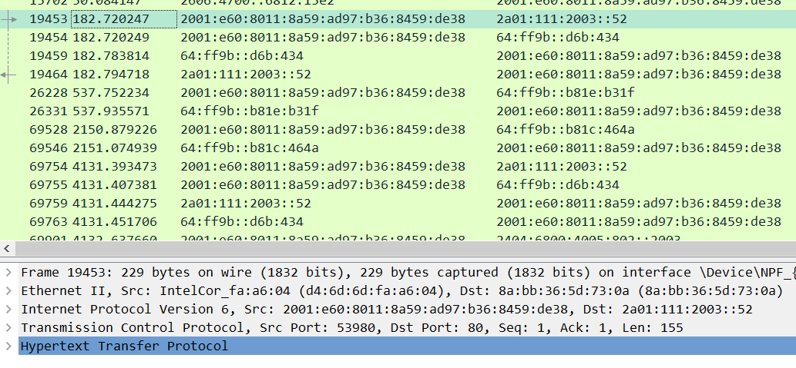
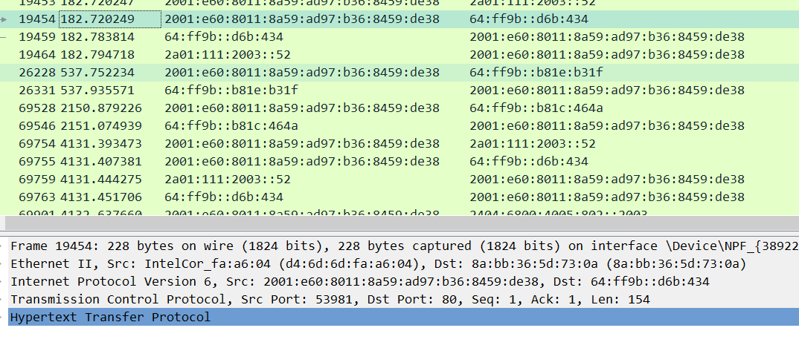

## 요청을 보내고 응답이 왔을 때, 자신의 응답인지 식별하는 방법이 뭔가?

##### 상황

- A, B 프로세스가 요청을 보냈을 때, 해당 포트로 응답이 오면 어떤 프로세스에 대한 응답인지를 어떻게 식별하여 콜백 함수가 실행되는지에 의문이 생겼다.

##### 해결

- 현재까지 이해한 바로 정리하자면, 각 요청은 자신만의 port를 가진다.

  - wireshark로 패킷을 캡쳐했을 때, 요청마다 port가 다른 것을 볼 수 있었다. 

  

