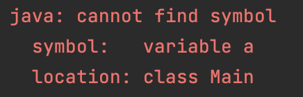

# 📖  Java 8 이후의 heap 메모리 구조와 GC 알고리즘 #1

### 개요

 기존에 나는 메모리 구조에 perm 영역이 존재하는걸로 공부하고 암기해왔었는데, java 8 이후에는 perm 영역이 사라지고 meta space라는 영역이 생겨났다고 들어서 이에 대해 공부를 해봤다. 


### Java 8 이후의 Heap 메모리 구조

기존의 **Permanent** 영역은 Java8부터 **Metaspace** 영역으로 변경되었다. 기존의 Permanent 영역에는 다음과 같은 정보들이 저장되었다.

- Class의 Meta Data
- Method 의 Meta Data
- Static Object 변수, 상수
- JVM, JIT 관련 데이터 등

이러한 데이터들을 저장하던 Permanent 영역을 자바 8에서부더는 Metaspace라는 영역으로 대체하였고, 이 Metaspace영역은 Native 메모리 영역으로  JVM이 아닌 **OS에 의해 관리**되도록 변경되었다.

즉, 자바 8 이후부터 static 객체는 heap 영역이 아닌 별도의 네이티브 메모리 영역에서 관리된다.


### 왜 바꼈을까?

 Collection 객체를 static하게 구현하여 값을 계속해서 추가하면 Perm영역이 가득차서 `OutOfMemoryError permgen space`라는 Error가 발생할 수도 있다.

```java
static List<Object> list = new ArrayList<>();
```

즉, 이러한 OOM 에러가 발생하는 현상을 개선하기 위해 기존에 Perm 영역에 저장되던 static Object의 변수와, 상수화된 static Object 를 Heap영역으로 이동시켜 GC의 대상이 되도록 변경하고, 메타데이터 정보들을 OS가 관리하는 영역으로 옮겨 Perm 영역의 사이즈 제한을 없앤 것이라고 할 수 있다.


### 결론

> ### 이렇게 이해했다!
>
> meta data와 같이 크기가 유동적이지 않은 것은 jvm 외부의 native 메모리에 저장하고, 유동적인 static 변수는 heap 영역에 저장함으로써 GC의 대상이 되게 했다. 기존에는 perm 영역에 저장했기 때문에, heap 영역에 자리가 더 있어도 perm 영역 크기 제한으로 인해 OOM이 발생했지만, 메모리 구조 변경 이후에는 perm 영역 크기 제한에 의한 문제가 해결되었다.


---

# 🤔 변수 이름으로 메모리에 어떻게 접근할까? #2

### 개요

 보통 메모리에 대해 설명을 할 때 `int i = 1` 에서 i라는 공간이 stack에 저장되고 1이라는 값이 담기고, Object 인 경우에는 값은 heap에 생성되고 이를 가르키는 메모리 주소가 stack 공간에 저장된다고 배웠다. 하지만, stack에 변수 이름으로 접근한다는게 확 와닿지 않았다. 이름도 결국은 데이터일텐데 이걸로 어떻게 접근하는걸까? 이에 대한 키워드로 symbol table을 서칭했고, 이에 대해 찾아보았다. 


### Symbol Table

- Java 컴파일러는 소스 코드를 컴파일하는 동안 변수, 메서드 및 클래스와 같은 식별자를 관리하기 위해 symbol table을 사용

- 컴파일러는 변수 이름과 해당 변수의 데이터 유형 및 메모리 위치를 저장

- symbol table은 실행 가능한 `.class` 파일의 일부가 되며, JVM이 클래스 파일을 로드하고 실행할 때 symbol table 정보를 사용하여 변수를 참조

- Reflection API를 이용해서 실행 중인 클래스의 symbol table 정보에 동적으로 액세스할 수 있음

  

### 개발 속의 symbol 보기

- 유효하지 않은 변수를 사용하면, 다음과 같이 symbol을 찾을 수 없다는 에러가 발생함



### 결론

symbol table에 변수 이름과 메모리 시작 주소가 매핑되어 저장된다. 이외에도 변수 타입, 사이즈 등이 저장된다. 변수에 접근하면, symbol table에서 변수의 주소를 조회해서 그 주소에 접근한다.


### 참고

https://docs.oracle.com/en/operating-systems/solaris/oracle-solaris/11.4/linkers-libraries/symbol-table-section.html


---

# 🤔 Static 변수와 인스턴스 변수가 symbol table에 저장되는 방식이 뭘까? #3

###### 연관: #2

### 개요

static 변수는 인스턴스 생성 전에도 접근이 가능한 변수로, 컴파일 시점에 메모리에 로드된다고 배웠다. 그래서 문득 static 변수와 인스턴스 변수가 symbol table에 저장되는 시점이 언젠지와 그 차이점에 대해 궁금증이 생겨 고민해봤다.


### 낫 확실~ 뇌피셜

> a라는 static 변수와 b라는 인스턴스 변수가 있다고 가정해보자.
>
> a (static 변수) 는 컴파일 시점에 해당 클래스의 symbol table에 저장이 된다.
>
> 인스턴스 변수는 클래스의 인스턴스가 생성될 때 메모리 공간이 할당되는데, 해당 인스턴스의 메모리 공간에 저장된다. 인스턴스의 메모리 공간에 a에 대한 참조는 포함하지 않는다. 인스턴스의 symbol은 이 인스턴스를 생성한 클래스의 symbol table에 저장된다.


### 결론

뇌피셜을 chatGPT에게 물어보니까 맞다고는 하는데, 아직 확실하진 않으니까 다음에 시간될 때 더 자세히 찾아보면 좋겠다:)