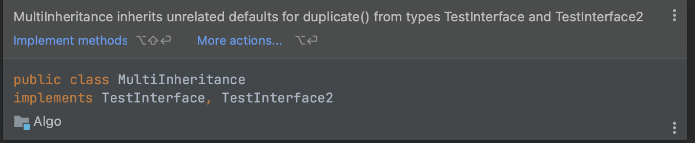

# 🤔 ❓Redis 분산 캐시 #4

### 개요

 무상태성의 성격을 가지는 HTTP 통신은 요청하는 클라이언트 컴퓨터의 정보를 보존하지 않기 때문에 로그인과 같은 보안 기능을 수행하기에 부적절하다. 이러한 특성을 보완하기 위해 생긴 것이 세션이다. 세션에는 클라이언트 컴퓨터에 세션 ID를 발급하고, 세션 ID에 해당 사용자의 정보를 저장한다. 하지만 이 방식은 확장성이 낮고 추가적인 저장 공간을 필요로 한다. 토큰 방식은 이러한 세션 방식의 단점을 보완하기 위해 나왔다. 서버의 시크릿키가 포함되어 인코딩된 토큰이 확인증의 역할로 사용자에게 발급이 된다. 인증이 필요한 서비스에는 사용자가 확인증과 함께 접근한다. 토큰에 있는 사용자의 정보와 서버의 시크릿키를 이용해서 인코딩했을 때, 사용자의 토큰과 동일한지를 확인하여 신원을 확인한다. 이 방식은 추가적인 저장공간을 필요로 하지 않고, 토큰만 네트워크 과정에 추가하면 되기 때문에 확장성도 뛰어나다. 하지만 "은총알은 없다"라는 말처럼 트레이드오프는 무조건 가지고 있다. 토큰 방식은 토큰을 누군가에게 탈취되는 순간 서버의 입장에선 해커르 그 사용자로 인식하게 된다. 많은 사람들이 사용하는 서비스에서 이런 일이 발생하면 파급력이 클 것이다. 그래서 네이버에서는 어떻게 할지 궁금하여 어떻게 구현했을지 분석해보았다. Ip 보안 이라는 기능을 사용하면 동일한 IP가 아니면 특정 서비스들에서 다시 로그인을 하도록 되어있었다. 폰의 경우엔 wifi나 4g와 같이 ip의 변동성이 커서 그런지 모르겠지만, ip가 다른 지역이거나 핸드폰 기종이 다른 경우로 제한할 수 있었다. 아무튼 결론적으로 IP와 user-agent와 같은 사용자 컴퓨터의 정보는 서버에 저장이 된다는 것을 알 수 있었다. 그런데 대규모 트래픽을 감당하기 위한 확장성이 필수일 네이버에서 이 세션 정보를 어떻게 관리하는지 궁금해졌다. MSA로 아키텍처가 구성되어 있으면 다른 마이크로서비스에서는 인증을 위해 **auth 마이크로서비스나 단일 DB에서 인증**을 해야할텐데, 그럼 병목현상이 발생할 것이다. 또 다른 방법으로 생각한 것이 각자 분산 캐시를 갖는 방법이다. 이에 대해서 좀 더 구체적으로 찾아보았다.

### 분산 캐시란?

>  여러 대의 컴퓨터에 캐시 데이터를 분산하여 저장하고 관리하는 기술이다. 나는 여기서 분산이라는 개념이 모호했다. 레플리케이션과 같이 동일한 데이터를 가지도록 저장소를 나누는 것도 분산이고, 파티셔닝과 같이 해싱을 이용해 데이터를 나누는 것도 분산이 아닌가? 모든 걸 분산이라고 표현해도 되는지가 약간 애매하지만, 여기서 내가 말하고 싶은 분산 캐시는 파티셔닝을 이용한 것이다. 처음에 생각했던 방법은 각각의 마이크로서비스에 캐시를 둬서 auth 서비스에 접근했을 때 이를 캐싱하는 방법을 떠올랐다. 하지만 이 방법은 원본이 갱신됐을 때 모든 서비스의 캐시를 갱신해줘야한다. kafka와 같은 이벤트큐를 사용하면  auth 서비스가 갱신이라는 이벤트를 발행했을 때, 이를 구독하는 모든 서비스가 캐시를 갱신해주도록 해도 될 것이다. 그런데 이러면 시스템이 복잡해질 것 같아서, 비교적 단순한 모델로 생각한 것이, 캐시 저장소를 공유하도록 하고, 파티셔닝을 통해 분산하여 가용성을 챙기는 방법을 생각했다. 성능면에서는 이전 방법이 더 나을 것 같은데, 둘 중에서 뭐가 더 나은 방법인지는 아직 잘 모르겠다,, 나중에 더 공부해서 알아가는 걸로

### 결론

세션 방식 인증 을 구현하는 방법으로 분산 캐시를 이용하는 방법을 고려해봤다. 이 방법이 괜찮은 방법인지에 대해서는 아직 확신이 들지 않는다. 나중에 성장한 후에 다시 돌아와서 봐보자ㅎㅎ

# 🤔 인터페이스 다중 상속을 했을 때 동일한 이름의 default 메서드가 각각 정의되어 있으면 어떻게 될까? #5

### 개요

클래스가 다중 상속이 되지 않는 이유가 동일한 이름의 메서드를 가졌을 때, 어떤 우선순위로 메서드를 선택하는지가 모호해서라고 얼핏 들은 적이 있다. 하지만 인터페이스의 default 메서드 기능은 이런 경우를 발생시킬 수 있다. 그 경우에 어떻게 되는지 궁금해서 테스트해봤다.

### 결국 오버라이딩..

두개의 인터페이스에 동일한 default 메서드를 정의한 후 상속시켰는데 다음과 같이 컴파일 오류가 발생했다.

결국은 오버라이딩을 해야하는 것이다. 궁금증 해결-!

### 결론

자바 너 모호한 경우에 대한 계획이 다 있구나?