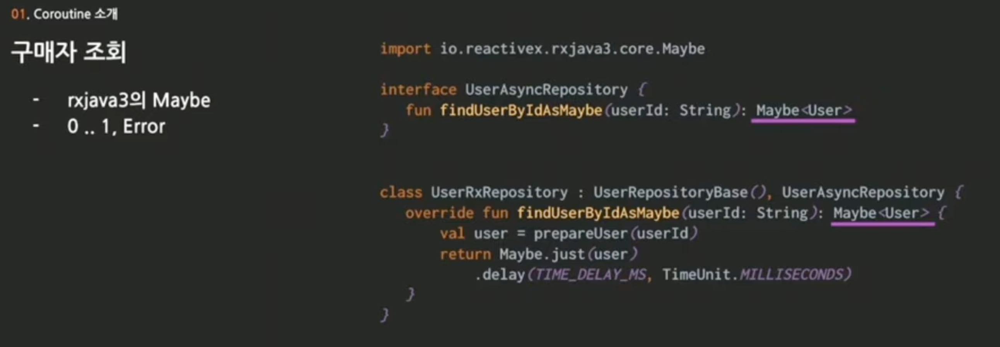

# 📖 Coroutines 뿌수기 #13

### 개요

비동기 프로그래밍에 대해서 관심을 가지게 되면서 coroutine에 자연스레 관심을 가지게 되었다. [당근마켓 밋업](https://www.youtube.com/watch?v=eJF60hcz3EU&list=LL&index=2&ab_channel=%EB%8B%B9%EA%B7%BC%ED%85%8C%ED%81%AC)에서 coroutine에 대해 잘 정리한 세션이 있는 거 같아서 한번 정리해보려고 한다.

### 비동기에 대한 고민

##### 동기의 단점

- 한 번에 이해하기 힘듦
- 추적이 어려움
- 에러 핸들링이 어려움

##### 다양한 비동기 라이브러리

- Spring reactor, CompletableFuture, hibernate react 등 다양한 비동기 라이브러리가 있음
- 어떻게 혼용해서 써야할까?
- 어떤 결과 타입을 반환해야 할까?
- 또 다른 비동기 라이브러리가 추가되면?

##### Coroutine이 해결사?

- 우수한 가독성
- 에러 핸들링
- 동시성 처리
- Flow
- Channel

### Coroutine 소개

##### 상품 주문 상황 가정

- 구매자 정보
- 상품 정보
- 스토어 정보
- 배송지

##### 기존의 동기 코드

### 

##### 비동기 코드로 변환

### 동기 코드 vs Coroutine

- coroutine은 블로킹하지 않음

- Coroutine은 경량화된 쓰레드일까? 특정 지점에서 정지했다가 재개할 수 있는 쓰레드?

- suspend 함수를 호출하면 shared data로 재귀 호출을 함

### FSM 기반의 동기 코드

- 맨 처음에는 state가 0이기 때문에, 첫 번째 블록이 실행됨

> 맨 처음에는 user 정보를 가져와서 resumeWith을 통해 this.user = user로 sharedData를 갱신하고, 두번째는 user를 기반으로 address 를 갱신한다. 각 state에 맞게 순서대로 갱신한다. 

### FSM 기반의 비동기 코드

- Continuation 인터페이스를 구현

- subscribe를 통해서 continuation의 resumeWith을 실행하도록 함. (동기코드에서는 subscribe가 let)

##### 실행 코드

### Coroutine으로 변환

- 위의 코드는 코틀린 코드를 바이트코드로 컴파일한 후 자바 코드로 디컴파일하면 얻을 수 있는 원본 코드임.
- 따라서 coroutine을 사용하면, 위의 코드를 더 간단하게 작성할 수 있음.

##### extension function을 붙임으로써 subscribe 코드 생략 가능

##### when 제거

##### continuation 제거

##### 최종 코드

### 결론

 coroutine을 쓰면 기존의 FSM 기반의 비동기 코드가 정말 간단해진다는 것을 알 수 있는 영상이었다. 하지만 아직 완전히 이해되지 않는 것은 위의 코드는 이전의 결과값이 이후에 사용되기 때문에 결국은 순서가 보장되어야 하는 동기적 방식이 아닌가? 어떤 부분이 비동기인지가 확 와닿지 않아서 더 공부해야겠다.

아 내가 코루틴에 대해서 제대로 공부를 하지 않아서 오해를 했나보다. 코루틴에 대해서 찾아보고 내가 이해한 한대로 코루틴을 정의하자면 "비동기 실행에서 유사(pseudo-) 동기적으로 동작할 수 있도록 하는 것" 이다. 코루틴은 **중단 가능한 함수 (suspendable functions)** 와 **일시 중단 포인트 (suspension points)** 를 사용해서 이루어진다고 한다. 그리고 이 방법이 동기적 실행과 비교해서 어떤 장점이 있냐고 하면, 다음과 같다.

- 기존의 동기 실행은 블록킹일 때, 해당 쓰레드가 아무 일을 하지 않은 상태로 쉬고 있기 때문에 시스템 자원을 비효율적으로 사용함.
- 코루틴을 이용하면 작업 처리는 동기 실행과 유사하게 보이지만, 리소스 사용의 효율성이 다름.
  - 기존에는 대기 상태에서 머물렀지만, 코루틴에서는 쓰레드가 자신의 일을 완수하면 대기 상태에 머물지 않고 바로 반납이 되기 때문에 다른 작업을 처리할 수 있음.

이전에 '오랜 시간이 필요한 작업을 처리할 때 (db 연동) 쓰레드가 대기 상태로 머문다면 서버의 쓰레드 풀이 낭비가 되지 않을까? ' 이런 생각을 한 적은 있었다. 그런데 이제야 답을 찾았다. 내가 원했던 방법이다..! 오늘도 한스택 성장 했다~