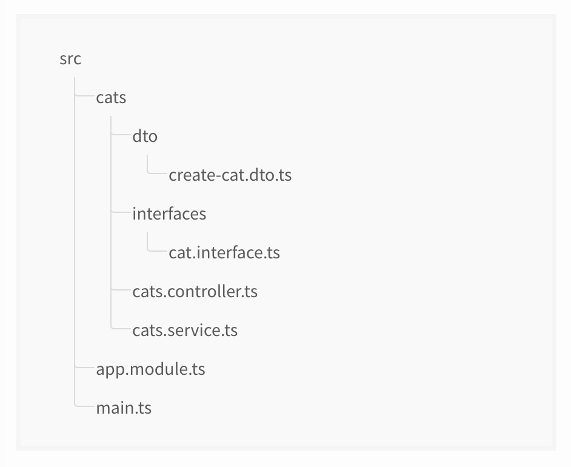
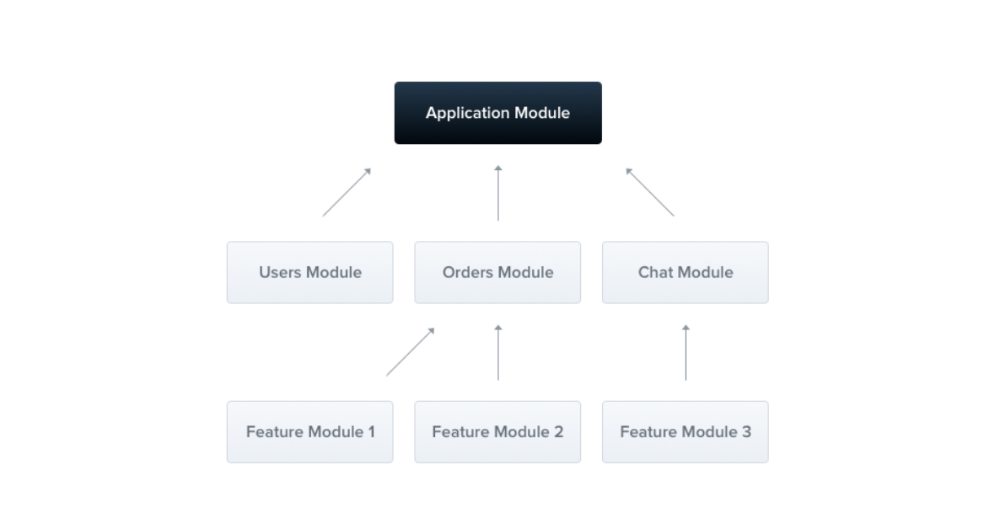

# 📖 NestJS #15

### 개요

단체 채팅 시스템 아키텍처를 구상해서 생각 정리 폴더에 정리해놓은 적이 있다. 최근에 CPU bound 작업은 스프링이 적합하고, IO bound 작업은 node JS가 적합하다는 것을 배웠다. 간략하게 정리하자면, nodejs는 싱글  이벤트 루프를 기반으로 동작한다. 멀티쓰레드로 동작하는 스프링은 하나의 쓰레드가 하나의 request에 대해 책임지며, 중간에 IO 작업 (ex. DB 작업, 외부 API 호출) 이 있다면 블록킹상태가 되고 해당 작업이 마무리될 때를 기다린다. 이런 동작방식은 쓰레드가 작업을 기다리는 동안 대기 상태로 머물기 때문에 극단적인 예시를 들자면 쓰레드풀의 모든 쓰레드가 대기 상태로 머물어서 CPU가 쉬고 있지만 요청이 처리되지 못하는 그런 문제상황도 발생할 수 있다. 동기 작업으로 발생할 수 있는 이런 문제는 코틀린의 코루팅과 같은 비동기 코드를 통해서 해결될 수도 있지만, 스프링은 기본적으로 동기로 진행되기 때문에 원하는대로 코드를 작성하려면 러닝커브 등 비용이 발생할 수 있다. 하지만 반면에, nodejs는 아예 싱글 이벤트 루프로 기반으로 동작하기 때문에, IO bound 작업이 많을 경우 유리하다. 대략적인 과정을 말하자면, 사용자의 요청이 왔을 때, 싱글 쓰레드는 사용자의 요청에 따라 IO 작업을 호출시킨다. 그동안 싱글스레드는 쉬지않고 다른 작업들을 처리한다. 마지막으로 이전에 요청했던 작업이 마무리되었을 때는 IO작업의 콜백함수가 이벤트 루프에 들어오고, 싱글쓰레드는 콜백함수를 처리한다. 이런 동작방식은 IO 작업이 많아도 CPU가 쉬지않고 계속 열심히 일을 처리하도록 하기 때문에 매우 유리하다. 그래서 결론을 말하자면, 이전에 구상했던 단체 채팅의 시스템 아키텍처를 nodejs 기반의 nestjs를 이용해서 구현해보고자 한다. 그리고 이 TIL에서 nestjs 초짜로써 첫 프로젝트를 진행하며 새롭게 배운 것들을 기록할 것이다.


### NestJS의 장점

1. **모듈화** : 모듈화된 구조를 제공하기 때문에 서버 애플리케이션의 다양한 부분을 논리적으로 분리하여 개발과 유지관리를 쉽게 만들 수 있다.
2. **의존성 주입** : TypeScript를 지원하며, 이를 통해 객체 지향과 디자인 패턴을 쉽게 적용할 수 있다. 기존의 NodeJS에서는 TypeScript를 실행하기 위해서 TypeScript 컴파일러나 Babel과 같은 도구를 사용해서 컴파일해야하지만, NestJS는 이런 프로세스를 추상화하여 기본적으로 TypeScript를 지원한다.
3. **강력한 라우팅 메커니즘** : 강력하고 확장성 있는 라우팅 시스템을 제공한다. 이를 통해 복잡한 백엔드 로직을 쉽게 구현하고 관리할 수 있다.
4. **테스트 용이성** : NestJS는 Jest를 내장하고 있어, 테스트 주도 개발(TDD)을 쉽게 할 수 있다.
5. **다양한 미들웨어와 라이브러리 지원** : 다양한 미들웨어와 라이브러리 (ex. TypeORM, Mongoose) 를 지원하며, 이들을 통해 다양한 기능을 쉽게 추가할 수 있다.
6. **WebSocket, GraphQL, gRPC 등 다양한 프로토콜 지원** : NestJS는 REST API 뿐만 아니라, 실시간 애플리케이션을 위한 WebSocket, 효율적인 데이터 조회를 위한 GraphQL, 마이크로서비스를 위한 gRPC 등 다양한 프로토콜을 지원한다.


### 기본 ts 파일의 역할

**`app.controller.ts`** : 싱글 라우트의 기본 컨트롤러

**`app.controller.spec.ts`** : 유닛 테스트를 위한 컨트롤러 ( `npm run test` 명령을 통해 테스트 가능)

**`app.module.ts`** : 어플리케이션의 루트 모듈

**`app.service.ts`** : 싱글 메서드의 기본 서비스

**`main.ts`** : Nest 어플리케이션을 생성하기 위한 `NestFactory`가 사용되는 시작 파일


### 라우팅

```java
import { Controller, Get } from '@nestjs/common';

@Controller('cats')
export class CatsController {
  @Get()
  findAll(): string {
    return 'This action returns all cats';
  }
}
```

대박 짱 편한 기능이 있다. 다음의 명령어를 쓰면 컨트롤러 파일을 쉽게 만들어준다.

```bash
$ nest g controller [name]
$ nest g service cats
```


### 디렉토리




### 모듈



```typescript
// cats.module.ts
import { Module } from '@nestjs/common';
import { CatsController } from './cats.controller';
import { CatsService } from './cats.service';

// @Global()
@Module({
  controllers: [CatsController],
  providers: [CatsService],
  // exports: [CatsService] (shared module: 공유 모듈)
})
export class CatsModule {}


// app.module.ts
import { Module } from '@nestjs/common';
import { CatsModule } from './cats/cats.module';

@Module({
  imports: [CatsModule],
})
export class AppModule {}
```

> 각 서비스 도메인마다 모듈을 만들어서 루드 모듈에서 import하면 캡슐화할 수 있을듯 하다.


# 📖 WebSocket vs socket.io #16

### 개요

websocket 통신을 이용한 채팅 서비스를 만드는 도중에 postman으로 테스트를 하려고 하는데, request 프로토콜 종류에 websocket과 socket.io가 있는 것을 확인했다. 이 두 프로토콜의 차이가 무엇인지 궁금해서 찾아봤다.

참고: https://www.peterkimzz.com/websocket-vs-socket-io/


### WebSocket 

- 양방향 소통을 위한 프로토콜
- HTML5 웹 표준 기술
- 매우 빠르게 작동하며 통신할 때 아주 적은 데이터를 이용함
- 이벤트를 단순히 듣고, 보내는 것만 가능함


### socket.io

- 양방향 통신을 하기위해 웹소켓 기술을 활용하는 라이브러리
- 소켓 연결 실패 시 fallback을 통해 다른 방식으로 알아서 해당 클라이언트와 연결을 시도함
- 방 개념을 이용해 일부 클라이언트에게만 데이터를 전송하는 브로드캐스팅이 가능함


### 어떤 경우에 사용될까?

- 서버에서 연결된 소켓들을 세밀하게 관리해야하는 서비스인 경우에는 Broadcasting 기능이 있는 socket.io을 쓰는게 유지보수 측면에서 훨씬 이점이 있음
- 가상화폐 거래소같이 데이터 전송이 많은 경우에는 빠르고 비용이 적은 표준 WebSocket을 이용하는 것이 좋음


### 결론

개요에서 둘다 프로토콜이라고 언급했지만, 엄밀히 말하자면 websocket은 프로토콜이고, socket.io는 라이브러리이다. 이 둘의 관계는 자바스크립트와 jQuery의 관계와 비슷하다고 할 수 있을 것이다. socket.io가 같은 기능을 구현하더라도 약간 느리지만, 많은 편의성을 제공한다. 또한 Java. C++, Python 등 여러 언어들의 라이브러리 또한 지원된다.


---

# 📖 스프링의 쓰레드와 운영체제의 네이티브 스레드 #17

### 개요

예전에 스프링의 쓰레드는 운영체제의 네이티브 스레드가 1대1로 연결된다는걸 얼핏 들은 기억이 있다. 그 당시 때는 스레드의 개념이 완벽하게 잡히지 않아서 그렇구나 하고 넘어갔는데, 이제는 준비가 되었다고 생각해서,,ㅎㅎ 다시 그 개념에 대해 공부해보려고 한다. 우선 위에 소켓 통신 프로젝트를 계속 해야하기 때문에 이건 chatGPT한테 물어보는 걸로 짧게 마무리할 것이다. 그러니까 다음에 다시 제대로 공부하도록..


### ChatGPT의 답 정리

- 자바 스레드는 기본적으로 운영체제의 네이티브 스레드와 1:1로 매핑됨
- 매핑은 JVM과 관련되며, JVM의 구현에 따라 달라질 수 있음
- HotSpot JVM의 경우, 하나의 자바 스레드를 하나의 네이티브 OS 스레드에 매핑 (1:1)
- Green Threads의 경우, 여러 자바 스레드를 하나의 OS 스레드에 매핑 (N:1)
- 스프링 서버의 스레드 풀에서 관리하는 스레드의 동작 방식은 스레드 풀의 구성과 JVM의 동작 방식에 따라 달라짐


### 결론

> 기본적으론 1:1이 맞다고 한다. 그러면 시분할 방식으로 네이티브 스레드가 동작될 경우 여러 요청이 번갈아가면서 병렬적으로 실행이 된다. nodeJS와 같은 싱글스레드의 경우엔 하나의 요청이 끝날 때까지 다른 요청이 실행되지 않을 것이다.

### 