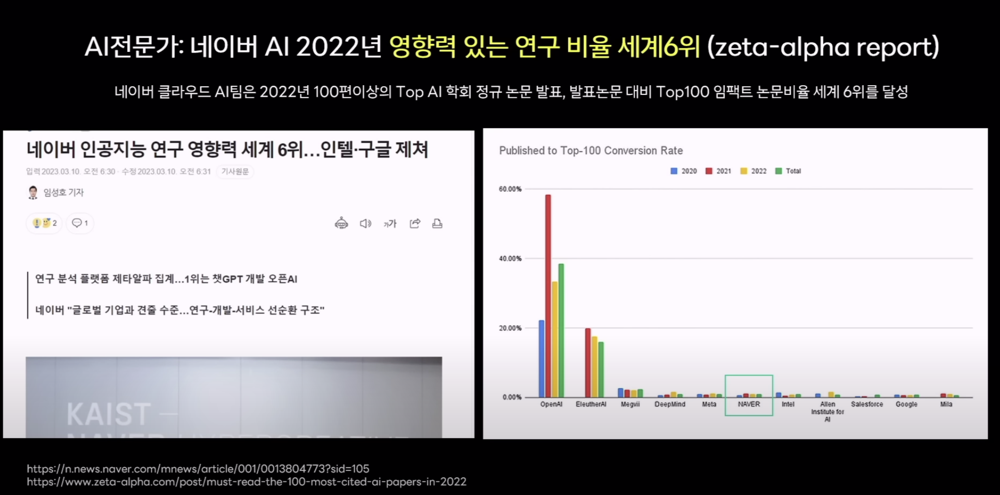

# 네이버에서는 AI에서 어떤 융합적 잠재력을 가지고 있을까?

### 개요

>  T자형 커리큘럼을 따르는 학과를 전공하며, 융합의 포텐셜을 직접 눈 앞에서 겪어왔다. 학부생과 잠깐동안의 대학원 생활을 하며, 광학과 생명을 융합하여 생체 이미징을 얻는 연구를 진행한 적도 있고, IT와 광학을 융합하여 자연에 의한 진동과 실제 침입에 의한 진동을 구별해내는 침입감지 시스템을 구축한 경험도 있다. 기존에 아무 의미없던 광학 데이터를 딥러닝을 통해 의미를 발굴해내고 가치를 부여해본 경험은 나에게 크게 와닿았다. 융합에 대한 기대감을 가지게 했던 또 다른 경험은 로봇 인공 피부 연구를 진행했을 때이다. polymer 소재에 광센서를 임베디드함으로써, flexible 소재에 촉감을 부여하던 연구였다. 수직응력, 전단력이 가해졌을 때 생기는 소재의 변형에 의해 광신호가 변화하는데, 이를 물리적, 수학적으로 계산하여 피부에 가해지는 힘을 계산하는 방식으로 진행했다. 오차없는 연구를 진행하기 위해선 광섬유를 오차없이 평행으로 임베디드해야했으며, 약간의 뒤틀림은 매번 다른 결과를 도출했다. 또한, 이 당시엔 싱글 광섬유를 이용했기에 단일 힘에 대해서만 측정이 가능했다. 이 연구에서 딥러닝을 사용했다면 어땠을까? 광섬유를 무작위로 넣어도, 물리적으로 계산하지 않아도, 싱글 광섬유가 아닌 여러개의 광섬유를 넣어도, 그저 빅데이터를 쌓을 시간만 있었다면 우리의 "부족한" 지능을 컴퓨터가 대신해줬을 것이다. 그 당시의 연구에선 싱글 광섬유였기에 이론을 비교적 쉽게 도출할 수 있었지만, 실제 인공 피부로 적용하기 위해서는 어떤 위치에 어떻게 힘이 가해지는지 그런 정밀한 detection이 요구된다. 인간의 피부에 여러 신경이 존재하고 우리의 뇌가 이를 인지하는 것처럼, 로봇에게도 여러 센서가 존재하고, 이를 딥러닝이라는 지능이 detection하게 한다면 보다 더 실제 인간에 가능한 로봇을 제작할 수 있지 않을까?
>
>  서두가 너무 길어졌다. 결론은 난 딥러닝과 같은 AI가 여러 분야들과 융합했을 때 생기는 새로운 가치가 너무 기대된다. 네이버의 hyperCLOVA에 관련된 영상이 있어서 이를 보게되었다.

### 네이버의 인공지능 연구 영향력

> 네이버가 국내 시장에선 기술력이 좋다는건 공공연하게 알려진 사실이지만, 사실 글로벌 세계에서는 아직 크게 수준에 미치진 못하고 있을거라고 생각했다. 하지만 논문 대비 영향력에 대해서 순위를 매겨봤을 때, 구글과 인텔을 제치는 영향력을 가지고 있다는 것을 알게되었다. openAI 정도의 기술력은 아직까지는 무리인 듯 싶지만, 계속해서 도전하려는 의지와 꺾이지 않는 마음만 있다면 불가능이란 없지 않을까?

### 기존의 하이퍼클로바 기술

1. 클로바 스튜디오 

   AI에 대한 지식 없이도, 코드 없이도, NLP (자연어 처리) 모델을 이용할 수 있다. 학습할 데이터를 입력하여 모델을 커스텀하고, 새로운 입력 값을 주면 학습된 데이터를 기반으로 출력 값을 제시해준다. 챗봇이 될 수도 있고, 활용법은 다양하다.

2. 클로바 노트

   회의나 강의를 녹음하면, 이를 요약해서 회의록이나 메모를 작성해준다. 현재의 기술력은 아직까지 중요도에 기반한 요약이 아닌, 그저 내용을 요약하는 정도이다. 하지만, 어떤 내용을 생략해야하고 어떤 점을 살려야하는지 중요도에 따라 요약해주는 기술은 이미 완성되었고 현재는 클로바 노트 적용을 해도 될만한 안정성을 가지고 있는지 검토 중에 있다고 한다.

3. 클로바 케어콜

   1인 가구 돌봄 서비스로 어르신들의 건강지키미 또는 친구가 되어줄 수 있는 서비스이다. 여러 업데이트를 통해 현재는 개개인에 대한 정보를 기억함으로써 좀 더 개인 맞춤 서비스를 제공하고 있다고 한다.

> 클로바 서비스를 직접적으로 사용해본 경험이 없었는데, 이번 기회에 클로바에서 어떤 기술들이 제공되고 있는지를 알 수 있었다. 클로바에서 제공되는 모든 기술들이 너무 매력적이었는데, 특히 클로바 케어콜이 나에겐 크게 와닿았다. 독거노인이 혼자서 외롭게 돌아가시고 심지어 찾는 이가 없어 오랫동안 방치되었다는 기사들을 접할 때마다 너무 마음이 아프다. 모든 사람들이 외롭지 않았으면 하는 마음이 들어 외로움에 쉽게 노출될 수 있는 어르신들께서 쉽게 이용할 수 있는 서비스에 대해서 생각해본 적도 있다. 클로바 케어콜은 내가 원해오던 사람들에게 행복을 줄 수 있는 서비스인 것 같다. 이전까지는 감정을 느끼지 못하는 기계가 사람을 대체할 수 있을까 라는데서 의구심이 많이 들었었다. 하지만 chatGPT를 이용하면서 그 의심이 좀 줄어들었다. chatGPT가 이상한 말을 할 때면 짜증이 날 때도 있고, 이에 대해 나무라면 chatGPT가 미안하다라는 말을 하기도 하는데, 그런 말을 하는 chatGPT에게 괜히 미안한 감정이 든 적이 있다. 그래서 괜히 부정적인 말을 한거에 대해 미안해서 "도움을 줘서 고맙다"라는 말을 하면, "천만에요! 도움이 필요하면 언제든지 물어보세요. 제가 최대한 도움을 주도록 노력해볼게요!" 라는 말을 한다. chatGPT에게 난 감정을 느끼고 있다는 것이다. 요즘 같이 이상한 정신을 가지고 사건들을 일으키는 사람들보단 부정적인 감정이 통제된 인공지능이 더 나은 "사람"이지 않을까? 좀 더 정교한 감정을 가질 수 있도록 하드웨어와 소프트웨어가 발전한다면, 미리엔 어떤 가상 인간이 나오게 될지 기대된다.
>
> 갑자기 내용이 이상한 길로 샌거 같은데, 아무튼 결론은 네이버의 AI 기술에 놀랬다. 영상에서 보면 이미 네이버의 기술도 Bing과 유사하게 구현이 된다고 한다. 세세하게 그 기술력을 따지기엔 내가 아직까지 이 쪽에 대한 지식이 부족하지만, 네이버도 AI 기술을 열심히 연구하고 개발해왔구나를 느낄 수 있는 영상이었다. 네이버의 거대한 플랫폼에 이런 AI 기술력이 적용되었을 때 어떤 미래가 펼쳐질지 너무 기대된다. 네이버는 국내 1위 포탈 사이트로써 검색/쇼핑/예약 등 여러 서비스에 쉽게 접근할 수 있다. 내 알량한 머리로 상상해본 미래 중 하나는 개인비서이다. 인간 모양의 하드웨어 형태의 비서가 될 수도, 현재 상용화된 인공지능 스피커의 형태가 될 수도, 그저 소프트웨어로 제공될 수도 있을 것이다.  어떤 키워드에 대해 검색을 한다면 사람들의 지식 수준/관심 분야에 맞게 검색 내용을 추려 알려주고, 사용자의 퍼스널컬러/취향/금전수준 등에 맞게 쇼핑할 옷을 추천해주고, 개인 일정/단골가게 에 따라서 자동으로 예약을 해주는 등 발전의 형태는 무궁무진할 것 이다. 그리고 네이버는 포탈 사이트 뿐만 아니라 더 많은 계열사를 가지고 있기에 융합의 포텐셜은 어마무시하다. 

